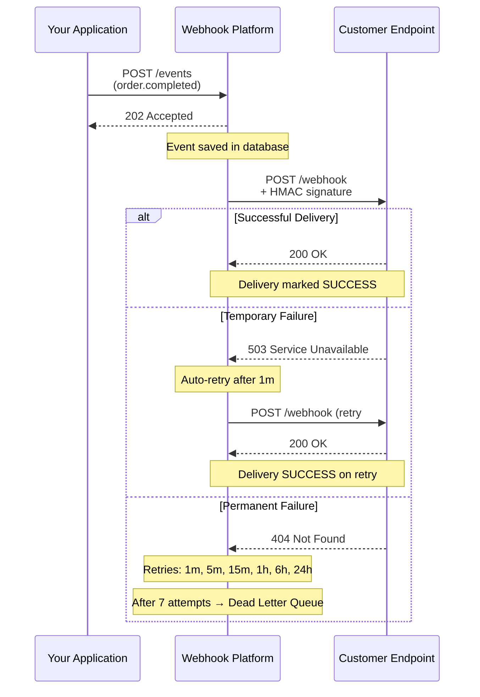
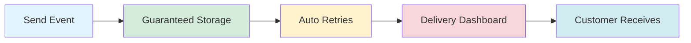
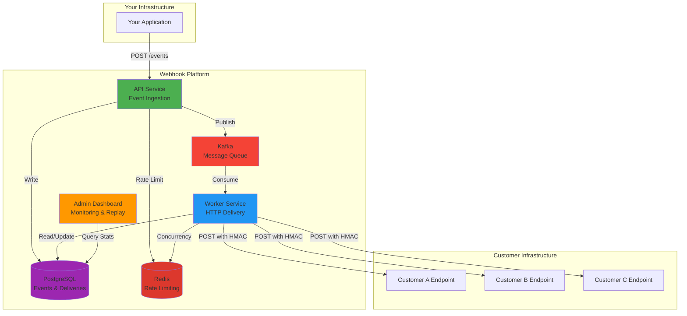

# Webhook Platform

[](https://github.com/vadymkykalo/webhook-platform/actions/workflows/ci.yml)
[](https://opensource.org/licenses/MIT)
[]()
[]()
[]()
[]()
[]()

**Enterprise-grade distributed webhook delivery system** with at-least-once guarantees, horizontal scaling, and sub-second latency.

> Built for **highload**: Redis distributed rate limiting, 12+ Kafka partitions, fully reactive delivery pipeline, multi-tenant isolation.

## Quick Start

```bash
git clone https://github.com/vadymkykalo/webhook-platform.git
cd webhook-platform
make up
```

Open http://localhost:5173 - done. All services start automatically.

**API Documentation**: http://localhost:8080/swagger-ui.html

## What it is

This platform handles reliable webhook delivery at scale using the transactional outbox pattern. Events are written to PostgreSQL, published to Kafka, and delivered to configured HTTP endpoints with HMAC signatures and exponential backoff retries.

Built for production use where delivery reliability, tenant isolation, and observability matter. The architecture separates ingestion from delivery to prevent backpressure and enables independent scaling of both concerns.

### Tech Stack

| Layer | Technology |
|-------|------------|
| **API** | Java 17, Spring Boot 3.2, Spring WebFlux |
| **Worker** | Java 17, Spring Kafka, Reactive WebClient |
| **Database** | PostgreSQL 16, Flyway migrations |
| **Message Broker** | Apache Kafka 3.7 (KRaft mode) |
| **Cache/State** | Redis 7 (Redisson client) |
| **UI** | React 18, TypeScript, Vite, TailwindCSS |
| **Observability** | Micrometer, Prometheus metrics |
| **Deployment** | Docker, Docker Compose |

## How It Works

### Event Flow: From Your App to Customer Endpoints



### What You Get



**Business Value:**
- **Reliability**: Events never lost, even if customer endpoint is down
- **Visibility**: See every delivery attempt, response code, and timing
- **Control**: Manually replay failed deliveries when customer fixes their endpoint
- **Security**: HMAC signatures prevent unauthorized webhook injection
- **Scale**: Handle millions of events per day without blocking your application

### System Architecture



### Retry Strategy Visualization

```mermaid
gantt
    title Automatic Retry Timeline for Failed Delivery
    dateFormat X
    axisFormat %M:%S
    
    section Delivery Attempts
    Attempt 1 (immediate)     :0, 10
    Wait 1m                   :10, 70
    Attempt 2 (1m)            :70, 80
    Wait 5m                   :80, 380
    Attempt 3 (5m)            :380, 390
    Wait 15m                  :390, 1290
    Attempt 4 (15m)           :1290, 1300
    Wait 1h                   :1300, 4900
    Attempt 5 (1h)            :4900, 4910
    Wait 6h                   :4910, 26510
    Attempt 6 (6h)            :26510, 26520
    Wait 24h                  :26520, 112920
    Attempt 7 (24h - final)   :112920, 112930
```



**Total retry window**: ~31 hours across 7 attempts. After that, delivery moves to Dead Letter Queue for manual review.

## Features

- Transactional outbox pattern for guaranteed event publishing
- HMAC-SHA256 webhook signatures with timestamp validation
- Exponential backoff retry strategy (1m to 24h, 7 attempts)
- Single and bulk delivery replay for manual intervention
- **Distributed rate limiting** via Redis (horizontal scaling ready)
- Organization-based multi-tenant isolation with JWT authentication
- Automated data retention policies for outbox and delivery attempts
- Admin dashboard with delivery statistics and endpoint health metrics
- Idempotent event ingestion via header-based deduplication
- Dead letter queue for exhausted retry deliveries

## Architecture overview

The platform consists of five components that together provide reliable webhook delivery.

**API service** receives HTTP events, writes them transactionally to PostgreSQL alongside delivery records, and runs a scheduled publisher that moves pending messages to Kafka topics.

**Worker service** consumes from Kafka, executes HTTP POST requests to webhook endpoints with HMAC signatures, records attempt details, and publishes failed deliveries to time-delayed retry topics or the dead letter queue.

**Message broker** (Kafka) decouples ingestion from delivery and provides natural time-based retry scheduling through multiple topics with different consumer lag patterns. Configured with 12 partitions by default for parallel processing.

**Redis** provides distributed rate limiting and concurrency control, enabling horizontal scaling of API and Worker services.

**Database** (PostgreSQL) is the source of truth for all state: events, deliveries, attempts, endpoints, subscriptions, and tenant configuration.

**UI** (React) provides management interface for projects, endpoints, subscriptions, and delivery inspection.

```
Client → API → Outbox → Kafka → Worker → Webhook Endpoint
           ↓      ↓        ↓         ↓
         Redis  PostgreSQL (events, deliveries, attempts)
          ↑                           ↑
     Rate Limiting            Concurrency Control
```

This architecture prevents event loss during downstream failures. The outbox ensures events reach Kafka before acknowledgment. Kafka persistence ensures delivery attempts survive worker crashes. The retry scheduler in the worker polls the database for deliveries needing retry and republishes them to appropriate time-delayed topics.

## SDKs

Official client libraries for integrating with Webhook Platform:

### Node.js

```bash
npm install @webhook-platform/node
```

```typescript
import { WebhookPlatform } from '@webhook-platform/node';

const client = new WebhookPlatform({ apiKey: 'wh_live_xxx' });

// Send event
const event = await client.events.send({
  type: 'order.completed',
  data: { orderId: '123', amount: 99.99 }
});

// Verify incoming webhook
import { verifySignature } from '@webhook-platform/node';
verifySignature(payload, signature, secret);
```

### Python

```bash
pip install webhook-platform
```

```python
from webhook_platform import WebhookPlatform, Event

client = WebhookPlatform(api_key="wh_live_xxx")

# Send event
event = client.events.send(
    Event(type="order.completed", data={"order_id": "123"})
)

# Verify incoming webhook
from webhook_platform import verify_signature
verify_signature(payload, signature, secret)
```

### PHP

```bash
composer require webhook-platform/php
```

```php
use WebhookPlatform\WebhookPlatform;

$client = new WebhookPlatform(apiKey: 'wh_live_xxx');

// Send event
$event = $client->events->send(
    type: 'order.completed',
    data: ['orderId' => '123']
);

// Verify incoming webhook
use WebhookPlatform\Webhook;
Webhook::verifySignature($payload, $signature, $secret);
```

See [Node.js SDK](./sdks/node/README.md), [Python SDK](./sdks/python/README.md), and [PHP SDK](./sdks/php/README.md) for complete API reference.

## Repository structure

**`/webhook-platform-api`** - Spring Boot REST API. Handles event ingestion with rate limiting and idempotency checks, manages projects/endpoints/subscriptions, provides delivery query and replay operations, runs the outbox publisher scheduler, contains Flyway migrations.

**`/webhook-platform-worker`** - Spring Boot Kafka consumer. Listens to dispatch and retry topics, executes webhook HTTP delivery with signature generation, records delivery attempts with full request/response data, runs retry scheduler that polls database for deliveries needing retry.

**`/webhook-platform-ui`** - React TypeScript application. Dashboard for delivery statistics, project and endpoint management, subscription configuration, delivery history with filtering.

**`/webhook-platform-common`** - Shared Java utilities. Crypto functions for AES-GCM encryption and HMAC signature generation, DTO classes for Kafka messages, common constants.

**`/sdks/node`** - Official Node.js/TypeScript SDK with full type definitions.

**`/sdks/python`** - Official Python SDK with type hints.

**`/sdks/php`** - Official PHP 8.1+ SDK with Laravel/Symfony examples.

## How it works

1. **Event ingestion** - Client sends event via REST API with API key authentication. System checks rate limit (100 events/second per project by default), validates idempotency key if provided, writes event to database.

2. **Delivery creation** - Transaction finds all active subscriptions matching event type, creates delivery records in PENDING status for each matching endpoint, writes outbox message in same transaction.

3. **Async processing** - Outbox publisher polls every 1 second for PENDING messages, publishes to `deliveries.dispatch` topic, marks as PUBLISHED in database.

4. **Initial delivery attempt** - Worker consumes message, loads delivery and endpoint data, decrypts webhook secret, generates HMAC signature, executes HTTP POST with 30-second timeout, records attempt with status code and response.

5. **Retry handling** - On 5xx or timeout, worker calculates next retry time using exponential backoff, updates delivery status to RETRY, publishes to time-delayed retry topic (1m, 5m, 15m, 1h, 6h, 24h).

6. **Failure handling** - On 4xx (except 408, 425, 429), marks delivery as FAILED. After 7 total attempts, publishes to DLQ topic and marks delivery as DLQ status.

7. **Manual replay** - Admin can replay individual or bulk deliveries via API, which resets attempt counter and republishes to dispatch topic.

## Deployment

The platform supports two deployment modes:

**Embedded DB** - PostgreSQL runs in Docker. Recommended for self-hosted deployments, development, and testing.

**External DB** - Connect to managed PostgreSQL (AWS RDS, Google Cloud SQL, Azure Database). Recommended for cloud/production deployments.

### Self-hosted (Embedded DB)

Prerequisites: Docker, Docker Compose.

```bash
# Start with defaults (development mode)
make up

# Access UI at http://localhost:5173
```

This automatically creates `.env` from `.env.dist` with working development defaults. Data persists in Docker volume `webhook_pgdata`.

**For production:** Edit `.env` and change `WEBHOOK_ENCRYPTION_KEY` and `JWT_SECRET` before starting.

### Cloud/Production (External DB)

Prerequisites: Docker, Docker Compose, PostgreSQL instance.

```bash
# Initialize configuration
make init

# Edit .env for external DB mode:
#   DB_MODE=external
#   DB_HOST=your-db-host.example.com
#   DB_PORT=5432
#   DB_NAME=webhook_platform
#   DB_USER=webhook_user
#   DB_PASSWORD=<secure password>
#   DB_SSL_MODE=require
#   WEBHOOK_ENCRYPTION_KEY=<32+ character string>
#   JWT_SECRET=<32+ character string>
#   KAFKA_BOOTSTRAP_SERVERS=<your-kafka-cluster>:9092
#   APP_ENV=production

# Start services (without embedded postgres)
make up-external-db
```

Migrations run automatically on API startup. Access UI at `http://localhost:5173`.

### First user registration

```bash
curl -X POST http://localhost:8080/api/v1/auth/register \
  -H "Content-Type: application/json" \
  -d '{"email":"admin@example.com","password":"secure_password","organizationName":"Your Company"}'
```

## Configuration

All configuration managed through `.env` file. Auto-created from `.env.dist` on first `make up`.

### Environment Variables Reference

**Application Mode:**
- `APP_ENV` - Environment mode: `development` (default) or `production`. Production mode enforces strict secret validation.

**Database - Mode Selection:**
- `DB_MODE` - Database deployment mode:
  - `embedded` (default) - PostgreSQL runs in Docker container, ideal for self-hosted
  - `external` - Connect to external/managed PostgreSQL, ideal for cloud deployment

**Database - Embedded Mode (when DB_MODE=embedded):**
- `POSTGRES_IMAGE` - PostgreSQL Docker image (default: `postgres:16-alpine`)
- `POSTGRES_DB` - Database name (default: `webhook_platform`)
- `POSTGRES_USER` - Database user (default: `webhook_user`)
- `POSTGRES_PASSWORD` - Database password (**change for production**, default: `webhook_dev_pass_12345`)
- `POSTGRES_PORT` - Exposed port (default: `5432`)
- `POSTGRES_VOLUME_NAME` - Docker volume name (default: `webhook_pgdata`)

**Database - External Mode (when DB_MODE=external):**
- `DB_HOST` - Database hostname (for embedded: `postgres`, for external: your DB host)
- `DB_PORT` - Database port (default: `5432`)
- `DB_NAME` - Database name (default: `webhook_platform`)
- `DB_USER` - Database username (default: `webhook_user`)
- `DB_PASSWORD` - Database password (**required for external mode**)
- `DB_SSL_MODE` - SSL mode: `disable` (dev), `require`, or `verify-full` (production)
- `DB_JDBC_URL` - Optional: Full JDBC URL override (if set, individual DB_* vars ignored)
- `DB_POOL_MAX_SIZE` - Connection pool max size (default: `10`)
- `DB_POOL_MIN_IDLE` - Connection pool min idle (default: `5`)
- `DB_POOL_CONNECTION_TIMEOUT` - Connection timeout in ms (default: `30000`)

**Redis Configuration:**
- `REDIS_IMAGE` - Redis Docker image (default: `redis:7-alpine`)
- `REDIS_HOST` - Redis hostname (default: `redis`)
- `REDIS_PORT` - Redis port (default: `6379`)
- `REDIS_MAXMEMORY` - Redis max memory (default: `256mb`)

**Kafka Configuration:**
- `KAFKA_BOOTSTRAP_SERVERS` - Kafka connection string (default: `kafka:9092` for embedded)
- `KAFKA_IMAGE` - Kafka Docker image (default: `apache/kafka:3.7.0`)
- `KAFKA_NUM_PARTITIONS` - Number of partitions per topic (default: `12`)

**Security (CRITICAL - Must Change for Production):**
- `WEBHOOK_ENCRYPTION_KEY` - AES-256 master key for encrypting webhook secrets. **Minimum 32 characters**. (**default dev value: `dev_encryption_key_32_chars_min`**)
- `JWT_SECRET` - Secret for signing JWT tokens. **Minimum 32 characters**. (**default dev value: `dev_jwt_secret_key_32_chars_minimum`**)

**API Service:**
- `API_PORT` - API HTTP port (default: `8080`)
- `API_IMAGE_TAG` - Docker image tag (default: `latest`)

**Worker Service:**
- `WORKER_PORT` - Worker management port (default: `8081`)
- `WORKER_IMAGE_TAG` - Docker image tag (default: `latest`)

**UI Service:**
- `UI_PORT` - UI HTTP port (default: `5173`)
- `UI_IMAGE_TAG` - Docker image tag (default: `latest`)

**MinIO (Optional - for future file attachments):**
- `MINIO_ROOT_USER` - MinIO admin username (default: `minio_admin`)
- `MINIO_ROOT_PASSWORD` - MinIO admin password (**change for production**, default: `minio_dev_password_12345`)
- `MINIO_PORT` - MinIO API port (default: `9000`)
- `MINIO_CONSOLE_PORT` - MinIO console port (default: `9001`)

**Data Retention Policies:**
- `DATA_RETENTION_OUTBOX_DAYS` - Days to keep published outbox messages (default: `7`)
- `DATA_RETENTION_ATTEMPTS_DAYS` - Days to keep delivery attempts (default: `90`)
- `DATA_RETENTION_MAX_ATTEMPTS_PER_DELIVERY` - Max attempts to retain per delivery (default: `10`)

### Configuration Examples

**Development (default):**
```bash
make up
# Uses embedded PostgreSQL + Kafka, development secrets
```

**Production with embedded database:**
```bash
# Edit .env:
APP_ENV=production
WEBHOOK_ENCRYPTION_KEY=<your-secure-32-char-key>
JWT_SECRET=<your-secure-32-char-key>
POSTGRES_PASSWORD=<strong-password>

make up
```

**Production with external database:**
```bash
# Edit .env:
APP_ENV=production
DB_MODE=external
DB_HOST=your-db.rds.amazonaws.com
DB_PASSWORD=<your-db-password>
DB_SSL_MODE=require
WEBHOOK_ENCRYPTION_KEY=<your-secure-32-char-key>
JWT_SECRET=<your-secure-32-char-key>

make up-external-db
```

### Security Validation

System performs startup validation:
- In `production` mode: Fails if secrets contain default/placeholder values
- Validates `WEBHOOK_ENCRYPTION_KEY` and `JWT_SECRET` are 32+ characters
- Checks database connectivity before starting services

Validation errors halt startup to prevent insecure deployments.

## Operational guarantees & limits

**Delivery semantics** - At-least-once delivery. Duplicate deliveries are possible during network partitions or worker crashes. Consumers should implement idempotency using `X-Delivery-Id` header.

**Retention policy** - Published outbox messages deleted after 7 days. Delivery attempts deleted after 90 days or when exceeding 10 attempts per delivery (keeps most recent). Deliveries and events persist indefinitely.

**Payload limits** - No hard limit enforced at ingestion. Large payloads increase memory usage and HTTP timeout risk. Recommended maximum 1 MB per event.

**Rate limits** - 100 events per second per project by default (configurable). Rate limit enforced at ingestion before database write. Exceeded requests receive 429 status with retry-after header.

**Retry limits** - 7 total delivery attempts over ~31 hours. After exhaustion, delivery moves to DLQ and requires manual replay.

**Timeout** - 30 seconds per HTTP delivery attempt. Non-configurable.

## Security model

**API authentication** - JWT-based authentication for management endpoints. Projects, endpoints, and subscriptions are scoped to organizations. Users belong to organizations via membership table with role-based access control.

**Event ingestion authentication** - API key authentication via `X-API-Key` header. Keys are hashed using SHA-256 and stored without plaintext. Each key is scoped to a single project.

**Webhook signatures** - Each webhook receives HMAC-SHA256 signature in `X-Signature` header formatted as `t=<timestamp>,v1=<hmac>`. HMAC is computed over concatenation of timestamp and request body. Prevents replay attacks via timestamp validation on receiver side.

**Secret storage** - Webhook secrets encrypted using AES-GCM with master key from environment variable. Encryption includes random IV stored alongside ciphertext. Decryption occurs only in worker during delivery.

**Tenant isolation** - All queries filtered by organization ID extracted from JWT. Database constraints prevent cross-tenant data access. Organizations are fully isolated with no shared resources.

## Testing & quality

Integration tests use Testcontainers with PostgreSQL and Kafka containers. Tests cover authentication flows, organization isolation enforcement, outbox publisher behavior, retry scheduler logic, concurrent cleanup operations with ShedLock, and data retention policies.

Test coverage includes:

- JWT authentication with organization context
- Role-based access control enforcement
- Multi-tenant isolation verification (cross-organization access attempts fail)
- Outbox message lifecycle (creation, publishing, cleanup)
- Retry scheduler polling and topic selection
- Data retention cleanup with batch processing
- Distributed lock behavior for scheduled jobs

Tests run against actual PostgreSQL and Kafka, not mocks. This validates schema migrations, Kafka consumer configurations, and transactional behavior. Build fails if any integration test fails.

## Highload & Performance

The platform is designed for horizontal scaling and high throughput:

| Component | Scaling Strategy | Default Config |
|-----------|-----------------|----------------|
| **API** | Horizontal (stateless) | Redis-based rate limiting |
| **Worker** | Horizontal (stateless) | Redis-based concurrency control |
| **Kafka** | Partition-based parallelism | 12 partitions per topic |
| **PostgreSQL** | Connection pooling | 20-30 connections per service |
| **Redis** | Distributed state | Single instance (cluster-ready) |

### Performance Characteristics

- **Ingestion**: 1000+ events/second per API instance
- **Delivery**: Non-blocking reactive pipeline, no thread blocking
- **Rate Limiting**: Distributed via Redis, consistent across all API instances
- **Concurrency Control**: Per-endpoint limits enforced globally via Redis semaphores

### Prometheus Metrics

Available at `/actuator/prometheus`:

```
# API metrics
api_rate_limit_hits_total
api_rate_limit_exceeded_total
events_ingested_total

# Worker metrics  
webhook_delivery_attempts_total{result="success|failure|error"}
webhook_delivery_latency_ms
webhook_rate_limit_hits_total
webhook_concurrency_acquired_total
webhook_concurrency_rejected_total
webhook_concurrency_active_permits
```

## Status & roadmap

**Production-ready components**: Event ingestion, transactional outbox, Kafka-based delivery, retry mechanism, HMAC signatures, multi-tenant isolation, JWT authentication, data retention, distributed rate limiting, horizontal scaling.

**Evolving components**: UI dashboard (functional but minimal), alerting integration.

**Explicitly out of scope**: Webhook endpoint verification, payload transformations, custom retry policies per subscription, batch delivery API, OAuth2 for webhook endpoints, geo-distributed deployment patterns.

## Makefile Commands Reference

### Lifecycle Management

**`make init`**
- Creates `.env` from `.env.dist` if not exists
- Safe to run multiple times (skips if `.env` already exists)
- Automatically called by `make up`

**`make up`**
- Start all services in **embedded database mode** (default for self-hosted)
- Auto-creates `.env`, builds Docker images, starts PostgreSQL + Kafka + API + Worker + UI
- Creates Kafka topics automatically
- Waits for services to become healthy
- **First-time run:** Takes 5-10 minutes (Maven/npm downloads dependencies)
- **Subsequent runs:** Fast (uses cached layers)

**`make up-external-db`**
- Start services in **external database mode**
- Does NOT start PostgreSQL container
- Requires `DB_MODE=external` and valid `DB_HOST`, `DB_PASSWORD` in `.env`
- Use for cloud deployments with managed databases (RDS, Cloud SQL, etc.)

**`make down`**
- Stop all services gracefully
- Preserves data (volumes not deleted)
- Safe to run multiple times
- Fallback commands included for cases where docker-compose fails

**`make stop`**
- Alias for `make down`

**`make clean`**
- Stop services and remove containers
- **Keeps volumes** (data preserved)
- **Keeps images** (build cache preserved)
- Use when containers are in a bad state

### Building & Rebuilding

**`make build`**
- Build Docker images for API, Worker, UI
- Uses multi-stage builds (Maven/npm run inside Docker)
- **No local Java or Node.js required**
- Caches layers for faster rebuilds

**`make rebuild`**
- Full rebuild with no cache (embedded DB mode)
- Equivalent to: `make down && make build --no-cache && make up`
- Use when Dockerfiles or dependencies change
- Takes longer (re-downloads all dependencies)

**`make rebuild-external-db`**
- Full rebuild with no cache (external DB mode)
- Same as `rebuild` but for external database deployments

### Development Commands (Fast Iteration)

**`make dev-api`**
- Quick rebuild API with cache + restart + follow logs
- **Fast** - uses Docker layer cache (rebuilds only changed code)
- Best for active API development
- Example: Changed controller → `make dev-api` → see logs immediately

**`make dev-worker`**
- Quick rebuild Worker with cache + restart + follow logs
- **Fast** - uses Docker layer cache
- Best for active Worker development
- Example: Changed retry logic → `make dev-worker` → see logs immediately

**`make dev-ui`**
- Quick rebuild UI with cache + restart + follow logs
- **Fast** - uses Docker layer cache
- Best for active UI development
- Example: Changed React component → `make dev-ui` → see logs immediately

**`make rebuild-api`**
- Rebuild ONLY API service (no cache, clean build)
- Faster than full `make rebuild` (doesn't rebuild Worker/UI)
- Use when API dependencies changed

**`make rebuild-worker`**
- Rebuild ONLY Worker service (no cache, clean build)
- Faster than full `make rebuild` (doesn't rebuild API/UI)
- Use when Worker dependencies changed

**`make rebuild-ui`**
- Rebuild ONLY UI service (no cache, clean build)
- Faster than full `make rebuild` (doesn't rebuild API/Worker)
- Use when UI npm packages changed

**`make restart-api`**
- Restart API container without rebuild
- **Instant** - no compilation, just container restart
- Use when testing config changes

**`make restart-worker`**
- Restart Worker container without rebuild
- **Instant** - no compilation, just container restart

**`make restart-ui`**
- Restart UI container without rebuild
- **Instant** - no compilation, just container restart

### Monitoring & Debugging

**`make logs`**
- Follow logs for all services (API, Worker, UI, Kafka, PostgreSQL)
- Press `Ctrl+C` to stop following

**`make logs-api`**
- Follow API service logs only

**`make logs-worker`**
- Follow Worker service logs only

**`make logs-ui`**
- Follow UI service logs only

**`make health`**
- Check health status of API and Worker services
- Hits `/actuator/health` endpoints
- Returns HTTP status codes

### Kafka Operations

**`make create-topics`**
- Create all required Kafka topics (idempotent)
- Topics: `deliveries.dispatch`, retry topics (`1m`, `5m`, `15m`, `1h`, `6h`, `24h`), `deliveries.dlq`
- Safe to run multiple times (uses `--if-not-exists`)
- Automatically called by `make up`

### Database Operations (Embedded Mode Only)

**`make shell-db`**
- Open PostgreSQL interactive shell (psql)
- Direct access to database for queries/debugging
- Requires embedded mode (won't work with external DB)

**`make backup-db`**
- Create compressed database backup
- Saves to `./backups/webhook_platform_YYYYMMDD_HHMMSS.sql.gz`
- Uses `pg_dump` inside PostgreSQL container
- **Only works with embedded database mode**
- Example: `make backup-db` → creates `backups/webhook_platform_20241217_153022.sql.gz`

**`make restore-db FILE=<path>`**
- Restore database from compressed backup
- Drops existing database and recreates
- **Destructive operation** - all current data is replaced
- Requires: `FILE=backups/webhook_platform_YYYYMMDD_HHMMSS.sql.gz`
- Example: `make restore-db FILE=backups/webhook_platform_20241217_153022.sql.gz`

### Diagnostics & Validation

**`make doctor`**
- Run system diagnostics
- Checks:
  - Docker installed and running
  - Docker Compose available (v1 or v2)
  - `.env` file exists
  - Required environment variables set (if external DB mode)
  - Secrets validation (if production mode)
- Use when troubleshooting deployment issues

### Destructive Operations

**`make nuke CONFIRM=YES`**
- **⚠️ DANGER: Destroys everything**
- Stops all services
- Removes all containers
- **Deletes all volumes** (all data lost permanently)
- Removes Docker networks
- Removes built images
- **Cannot be undone**
- Requires explicit confirmation: `CONFIRM=YES`
- Use only for complete clean slate (e.g., switching databases)

Example:
```bash
make nuke CONFIRM=YES
```

### Operational Workflows

**First-time setup (self-hosted):**
```bash
make up              # Creates .env, builds images, starts everything
# Access UI at http://localhost:5173
```

**Daily development:**
```bash
make up              # Start
make logs            # Watch logs
make down            # Stop
```

**Code changes (fast iteration):**
```bash
# Working on API:
make dev-api         # Rebuild API (with cache) + follow logs

# Working on Worker:
make dev-worker      # Rebuild Worker (with cache) + follow logs

# Working on UI:
make dev-ui          # Rebuild UI (with cache) + follow logs

# Full rebuild when dependencies change:
make rebuild-api     # Only API (no cache)
make rebuild-worker  # Only Worker (no cache)
make rebuild-ui      # Only UI (no cache)

# Full system rebuild:
make rebuild         # All services (no cache)
```

**Production deployment:**
```bash
# 1. Edit .env with production values
nano .env

# 2. Validate configuration
make doctor

# 3. Start services
make up-external-db  # If using external DB
# OR
make up              # If using embedded DB

# 4. Check health
make health
```

**Backup & restore:**
```bash
# Backup before maintenance
make backup-db

# Restore if needed
make restore-db FILE=backups/webhook_platform_20241217_153022.sql.gz
```

**Clean slate:**
```bash
make nuke CONFIRM=YES
make up
```

### Persistence & Data Safety

**Embedded mode:**
- Data stored in Docker volume: `webhook_pgdata`
- Survives `make down` and `make clean`
- Only deleted by `make nuke CONFIRM=YES`
- Backup recommended: `make backup-db`

**External mode:**
- Data in managed database
- Not affected by any make commands
- Backup via cloud provider tools

## Contribution

Standard GitHub workflow: fork, branch, test, pull request. Ensure integration tests pass before submitting. Use conventional commit messages.

No local Maven or npm builds required. All builds happen in Docker via `make build`.

