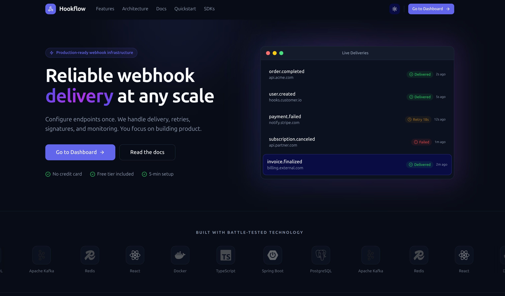
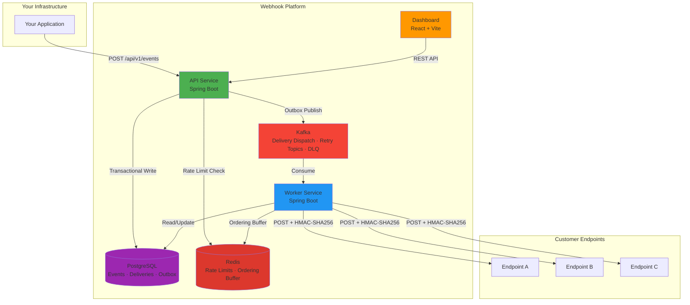
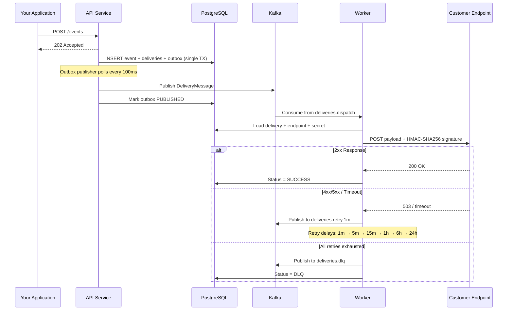

# Webhook Platform

[](https://github.com/vadymkykalo/webhook-platform/actions/workflows/ci.yml)
[](https://opensource.org/licenses/MIT)
[](https://www.docker.com/)
[]()
[]()
[]()
[]()
[]()

Production-grade webhook delivery infrastructure with **at-least-once guarantees**, FIFO ordering, automatic retries, HMAC signatures, and horizontal scaling. Self-hosted alternative to Svix / Hookdeck.

<div align="center">
  
</div>

```bash
git clone https://github.com/vadymkykalo/webhook-platform.git
cd webhook-platform
make up
```

**Dashboard** → http://localhost:5173 &nbsp;|&nbsp; **API Docs** → http://localhost:8080/swagger-ui.html

---

## Architecture



| Service | Port | Role |
|---------|------|------|
| **API** | 8080 | Event ingestion, REST API, outbox publisher, Flyway migrations |
| **Worker** | 8081 | Kafka consumer, HTTP delivery, retry scheduling, stuck delivery recovery |
| **UI** | 5173 | Admin dashboard (React / Vite / TailwindCSS / shadcn/ui) |
| **PostgreSQL** | 5432 | Persistent storage |
| **Kafka** | 9092 | Message broker (dispatch + 6 retry delay topics + DLQ) |
| **Redis** | 6379 | Rate limiting, FIFO ordering buffer |

---

## Features

- Transactional outbox → Kafka → at-least-once delivery
- FIFO ordering per endpoint (Redis ordering buffer)
- Retries with configurable delays + Dead Letter Queue
- HMAC-SHA256 signatures, AES-GCM secrets, mTLS, endpoint verification
- Multi-tenant: Organizations → Projects → Endpoints → Subscriptions (RBAC)
- Redis rate limiting, Prometheus metrics, built-in Request Bin
- Horizontal scaling: stateless services, 12 Kafka partitions

---

## Quick Start

**Prerequisites:** Docker 20.10+, Docker Compose v2+, make.
Everything else runs inside containers.

```bash
git clone https://github.com/vadymkykalo/webhook-platform.git
cd webhook-platform
make up        # build, start, create Kafka topics, run migrations
```

Open http://localhost:5173, register, create a project + API key, then:

```bash
curl -X POST http://localhost:8080/api/v1/projects/{projectId}/events \
  -H "X-API-Key: YOUR_API_KEY" \
  -H "Content-Type: application/json" \
  -d '{"type": "order.completed", "payload": {"orderId": "12345"}}'
```

---

## Deployment

### Development

```bash
make up          # Start all services
make down        # Stop (data preserved)
make logs        # Follow logs
```

### Production

```bash
cp .env.dist .env   # then edit .env
make up             # or: make up-external-db (for managed DB)
make health         # verify all services are UP
```

All environment variables are documented in [`.env.dist`](./.env.dist).

## Make Commands

Run `make help` for the full list. Key commands:

```bash
make up                   # Start everything from scratch
make down                 # Stop (keeps data)
make nuke CONFIRM=YES     # Destroy everything (containers, volumes, images)
make health               # Check service health
make logs                 # Follow all logs
make dev-api              # Quick rebuild API + tail logs
make backup-db            # Backup database to ./backups/
make doctor               # Pre-flight diagnostics
```

---

## SDKs

| Language | Package | Docs |
|----------|---------|------|
| **Node.js** | `npm install @webhook-platform/node` | [README](./sdks/node/README.md) |
| **Python** | `pip install webhook-platform` | [README](./sdks/python/README.md) |
| **PHP** | `composer require webhook-platform/php` | [README](./sdks/php/README.md) |

All SDKs include signature verification, error handling, and idempotency support.

---

## How Delivery Works



---

## Contributing

Fork → branch → test → PR. All CI checks must pass. See [CONTRIBUTING.md](./CONTRIBUTING.md).

## License

[MIT](./LICENSE) © Vadym Kykalo
