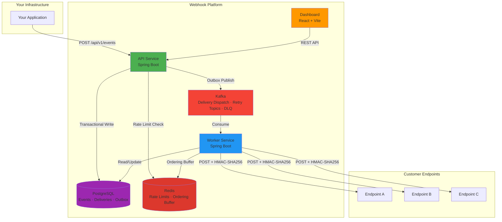
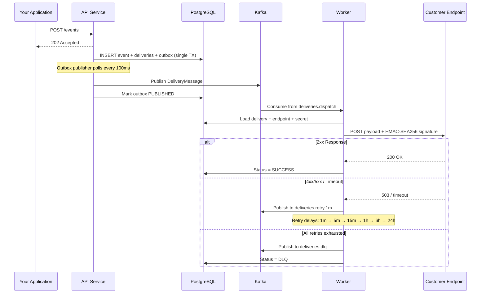

# Webhook Platform

[](https://github.com/vadymkykalo/webhook-platform/actions/workflows/ci.yml)
[](https://opensource.org/licenses/MIT)
[](https://www.docker.com/)
[]()
[]()
[]()
[]()
[]()

Production-grade webhook delivery infrastructure with **at-least-once guarantees**, FIFO ordering, automatic retries, HMAC signatures, and horizontal scaling. Self-hosted alternative to Svix / Hookdeck.

<div align="center">
  
</div>

```bash
git clone https://github.com/vadymkykalo/webhook-platform.git
cd webhook-platform
make up
```

**Dashboard** → http://localhost:5173 &nbsp;|&nbsp; **API Docs** → http://localhost:8080/swagger-ui.html

---

## Table of Contents

- [Features](#features)
- [Architecture](#architecture)
- [Quick Start](#quick-start)
- [Deployment](#deployment)
- [Configuration](#configuration)
- [Make Commands](#make-commands)
- [SDKs](#sdks)
- [API Overview](#api-overview)
- [How Delivery Works](#how-delivery-works)
- [Project Structure](#project-structure)
- [Contributing](#contributing)
- [License](#license)

---

## Features

| Category | Details |
|----------|---------|
| **Reliable Delivery** | Transactional outbox pattern → Kafka → Worker. At-least-once semantics, idempotency keys |
| **FIFO Ordering** | Per-endpoint sequence numbers with Redis-backed ordering buffer and gap detection |
| **Retry & DLQ** | Configurable per-subscription: max attempts, custom delays, exponential backoff. Dead Letter Queue for exhausted deliveries |
| **Security** | HMAC-SHA256 signatures, AES-GCM secret encryption, secret rotation with grace period, mTLS, endpoint verification challenge, JWT auth |
| **Multi-Tenancy** | Organizations → Projects → Endpoints → Subscriptions. RBAC with role-based membership |
| **Rate Limiting** | Redis token-bucket per project (configurable req/s) |
| **Observability** | Prometheus metrics (`/actuator/prometheus`), full request/response history per attempt, dashboard with live status |
| **Payload Transform** | Per-subscription payload templates and custom HTTP headers |
| **Test Endpoints** | Built-in Request Bin — create temporary endpoints to capture and inspect webhook payloads |
| **Data Retention** | Automated cleanup of old outbox messages and delivery attempts via scheduled jobs with ShedLock |
| **Horizontal Scale** | Stateless API/Worker services, 12 Kafka partitions, `FOR UPDATE SKIP LOCKED` for concurrent outbox publishing |

---

## Architecture



**Services:**

| Service | Port | Role |
|---------|------|------|
| **API** | 8080 | Event ingestion, REST API, outbox publisher, Flyway migrations |
| **Worker** | 8081 | Kafka consumer, HTTP delivery, retry scheduling, stuck delivery recovery |
| **UI** | 5173 | Admin dashboard (React / Vite / TailwindCSS / shadcn/ui) |
| **PostgreSQL** | 5432 | Persistent storage (events, deliveries, outbox, users, orgs) |
| **Kafka** | 9092 | Message broker (dispatch + 6 retry delay topics + DLQ) |
| **Redis** | 6379 | Rate limiting, FIFO ordering buffer, sequence tracking |

---

## Quick Start

### Prerequisites

| Tool | Version | Notes |
|------|---------|-------|
| **Docker** | 20.10+ | Container runtime |
| **Docker Compose** | v2.0+ | Service orchestration |
| **make** | any | Build automation |

> All other dependencies (Java 17, PostgreSQL 16, Kafka 3.7, Redis 7) run inside Docker — no local installation needed.

### 1. Clone and start

```bash
git clone https://github.com/vadymkykalo/webhook-platform.git
cd webhook-platform
make up
```

This will:
1. Create `.env` from `.env.dist` (if not exists)
2. Run pre-flight checks (`make doctor`)
3. Build and start all containers
4. Create Kafka topics (8 topics × 12 partitions)
5. Run database migrations (Flyway)
6. Print health status

### 2. Register and get API key

Open http://localhost:5173, create an account, then create a project and an API key.

### 3. Send your first event

```bash
curl -X POST http://localhost:8080/api/v1/projects/{projectId}/events \
  -H "X-API-Key: YOUR_API_KEY" \
  -H "Content-Type: application/json" \
  -d '{
    "type": "order.completed",
    "payload": {"orderId": "12345", "amount": 99.99}
  }'
```

---

## Deployment

### Development (embedded database)

```bash
make up          # Start everything (PostgreSQL in Docker)
make down        # Stop (data preserved in volumes)
make logs        # Follow all logs
```

### Production

1. **Copy and edit environment:**

```bash
cp .env.dist .env
```

2. **Set required production values in `.env`:**

```env
APP_ENV=production
DB_MODE=embedded                              # or external

# MUST CHANGE — startup will fail with placeholders
WEBHOOK_ENCRYPTION_KEY=your-32-char-key-here  # AES-GCM encryption for secrets
JWT_SECRET=your-32-char-jwt-secret-here       # JWT signing key

# For external database (DB_MODE=external):
DB_HOST=your-rds-instance.amazonaws.com
DB_PORT=5432
DB_NAME=webhook_platform
DB_USER=webhook_user
DB_PASSWORD=secure-password
DB_SSL_MODE=require
```

3. **Start services:**

```bash
make up                  # Embedded DB mode (default)
make up-external-db      # External DB mode (validates DB_HOST is set)
```

4. **Verify:**

```bash
make health
# API:    UP
# Worker: UP
# Redis:  PONG
# UI:     200
```

### Production checklist

- [ ] `APP_ENV=production`
- [ ] `WEBHOOK_ENCRYPTION_KEY` — unique, 32+ chars, not the default
- [ ] `JWT_SECRET` — unique, 32+ chars, not the default
- [ ] `WEBHOOK_ALLOW_PRIVATE_IPS=false`
- [ ] `SWAGGER_ENABLED=false`
- [ ] `CORS_ALLOWED_ORIGINS` — your actual domain
- [ ] Database backups configured (`make backup-db` or external RDS snapshots)
- [ ] Prometheus scraping `/actuator/prometheus` on ports 8080/8081
- [ ] Log level set to `WARN` or `ERROR` for high throughput

### External database mode

For managed PostgreSQL (AWS RDS, Google Cloud SQL, etc.):

```bash
# .env
DB_MODE=external
DB_HOST=your-db-host.com
DB_PORT=5432
DB_NAME=webhook_platform
DB_USER=webhook_user
DB_PASSWORD=secure-password
DB_SSL_MODE=require
DB_POOL_MAX_SIZE=20
```

```bash
make up-external-db
```

Flyway migrations run automatically on API startup.

---

## Configuration

All configuration lives in `.env`. Full reference: [`.env.dist`](./.env.dist)

### Key settings

| Variable | Default | Description |
|----------|---------|-------------|
| `DB_MODE` | `embedded` | `embedded` (PostgreSQL in Docker) or `external` (managed DB) |
| `APP_ENV` | `development` | `development` / `staging` / `production` |
| `WEBHOOK_ENCRYPTION_KEY` | dev default | AES-GCM key for secret encryption (**change in prod**) |
| `JWT_SECRET` | dev default | JWT signing key (**change in prod**) |
| `EVENT_INGESTION_RATE_LIMIT_PER_SECOND` | `100` | Rate limit per project |
| `KAFKA_NUM_PARTITIONS` | `12` | Partitions per topic (parallelism) |
| `WEBHOOK_ALLOW_PRIVATE_IPS` | `true` | Block private IPs in production |
| `DATA_RETENTION_OUTBOX_DAYS` | `7` | Days to keep published outbox messages |
| `DATA_RETENTION_ATTEMPTS_DAYS` | `90` | Days to keep delivery attempt history |
| `ORDERING_GAP_TIMEOUT_SECONDS` | `60` | FIFO gap tolerance before skip |
| `LOG_LEVEL` | `INFO` | `TRACE` / `DEBUG` / `INFO` / `WARN` / `ERROR` |

---

## Make Commands

### Lifecycle

| Command | Description |
|---------|-------------|
| `make up` | Initialize `.env`, run checks, build and start all services (embedded DB) |
| `make up-external-db` | Same but for external database mode |
| `make down` | Stop all services (volumes preserved) |
| `make clean` | Stop + remove containers (volumes preserved) |
| `make rebuild` | Full rebuild from scratch (no cache) + restart |

### Development

| Command | Description |
|---------|-------------|
| `make dev-api` | Quick rebuild API (with cache) + tail logs |
| `make dev-worker` | Quick rebuild Worker (with cache) + tail logs |
| `make dev-ui` | Quick rebuild UI (with cache) + tail logs |
| `make rebuild-api` | Rebuild API from scratch (no cache) |
| `make rebuild-worker` | Rebuild Worker from scratch (no cache) |
| `make rebuild-ui` | Rebuild UI from scratch (no cache) |
| `make restart-api` | Restart API container (no rebuild) |
| `make restart-worker` | Restart Worker container (no rebuild) |
| `make restart-ui` | Restart UI container (no rebuild) |

### Monitoring

| Command | Description |
|---------|-------------|
| `make logs` | Follow logs for all services |
| `make logs-api` | Follow API logs |
| `make logs-worker` | Follow Worker logs |
| `make logs-ui` | Follow UI logs |
| `make health` | Check health of all services |

### Database

| Command | Description |
|---------|-------------|
| `make shell-db` | Open `psql` shell (embedded mode only) |
| `make backup-db` | Create gzipped backup in `./backups/` |
| `make restore-db FILE=backups/file.sql.gz` | Restore from backup (drops + recreates) |

### Infrastructure

| Command | Description |
|---------|-------------|
| `make create-topics` | Create Kafka topics (idempotent) |
| `make doctor` | Run pre-flight diagnostics |
| `make build` | Build all Docker images (no cache) |
| `make nuke CONFIRM=YES` | **Destroy everything** — containers, volumes, images, networks |

---

## SDKs

| Language | Package | Version | Docs |
|----------|---------|---------|------|
| **Node.js** | `npm install @webhook-platform/node` | 1.1.0 | [README](./sdks/node/README.md) |
| **Python** | `pip install webhook-platform` | 1.1.0 | [README](./sdks/python/README.md) |
| **PHP** | `composer require webhook-platform/php` | 1.1.0 | [README](./sdks/php/README.md) |

All SDKs include: signature verification, error handling, rate limit support, idempotency keys.

---

## API Overview

Base URL: `http://localhost:8080/api/v1`

| Method | Endpoint | Description |
|--------|----------|-------------|
| `POST` | `/projects/{id}/events` | Send event (with idempotency key) |
| `POST` | `/projects/{id}/events/test` | Send test event |
| `GET` | `/projects/{id}/events` | List events |
| `POST` | `/projects/{id}/endpoints` | Create endpoint |
| `PUT` | `/projects/{id}/endpoints/{id}` | Update endpoint |
| `POST` | `/projects/{id}/endpoints/{id}/rotate-secret` | Rotate HMAC secret |
| `POST` | `/projects/{id}/endpoints/{id}/verify` | Trigger endpoint verification |
| `POST` | `/projects/{id}/subscriptions` | Create subscription |
| `GET` | `/projects/{id}/deliveries` | List deliveries |
| `POST` | `/projects/{id}/deliveries/{id}/retry` | Manual retry |

Full interactive docs at [Swagger UI](http://localhost:8080/swagger-ui.html).

Authentication: `X-API-Key` header with project API key, or `Authorization: Bearer <JWT>` for dashboard.

---

## How Delivery Works



### Retry topics

| Topic | Delay | Attempt |
|-------|-------|---------|
| `deliveries.dispatch` | immediate | 1 |
| `deliveries.retry.1m` | 1 min | 2 |
| `deliveries.retry.5m` | 5 min | 3 |
| `deliveries.retry.15m` | 15 min | 4 |
| `deliveries.retry.1h` | 1 hour | 5 |
| `deliveries.retry.6h` | 6 hours | 6 |
| `deliveries.retry.24h` | 24 hours | 7 |
| `deliveries.dlq` | — | exhausted |

Retry delays are **configurable per subscription**.

---

## Project Structure

```
webhook-platform/
├── webhook-platform-api/          # API service (Spring Boot)
│   ├── src/main/java/.../api/
│   │   ├── controller/            # REST controllers
│   │   ├── service/               # Business logic, outbox publisher, data retention
│   │   ├── domain/                # JPA entities, repositories, enums
│   │   ├── dto/                   # Request/Response DTOs
│   │   ├── config/                # Security, Kafka, CORS, rate limiting
│   │   └── security/              # JWT auth, API key filter
│   └── src/main/resources/
│       ├── db/migration/          # Flyway migrations (single V001)
│       └── application.yml
│
├── webhook-platform-worker/       # Worker service (Spring Boot)
│   ├── src/main/java/.../worker/
│   │   ├── kafka/                 # Kafka consumers (dispatch, retry, DLQ)
│   │   ├── service/               # Delivery, ordering buffer, retry scheduler
│   │   └── domain/                # Worker-side entities & repositories
│   └── src/main/resources/
│       └── application.yml
│
├── webhook-platform-common/       # Shared module
│   ├── constants/                 # Kafka topics
│   ├── dto/                       # DeliveryMessage DTO
│   ├── security/                  # URL validator
│   ├── util/                      # Crypto, HMAC signatures
│   └── validation/                # Encryption key validator
│
├── webhook-platform-ui/           # Dashboard (React + Vite + TailwindCSS)
│   └── src/
│       ├── pages/                 # Endpoints, Subscriptions, Deliveries, Events
│       ├── components/            # Shared UI components (shadcn/ui)
│       └── api/                   # API client layer
│
├── sdks/                          # Official SDKs
│   ├── node/                      # TypeScript SDK
│   ├── python/                    # Python SDK
│   └── php/                       # PHP SDK
│
├── docker-compose.yml             # All services orchestration
├── Makefile                       # Build automation (make help)
├── .env.dist                      # Environment template
└── .github/workflows/             # CI/CD (build, test, Docker, SDK publish)
```

---

## Contributing

1. Fork the repository
2. Create a feature branch (`git checkout -b feature/my-feature`)
3. Make changes and add tests
4. Run the full build: `make rebuild`
5. Submit a Pull Request

All CI checks (backend build, unit tests, integration tests with Testcontainers, frontend lint + typecheck, Docker image build) must pass before merge.

See [CONTRIBUTING.md](./CONTRIBUTING.md) for details.

---

## License

[MIT](./LICENSE) © Vadym Kykalo
