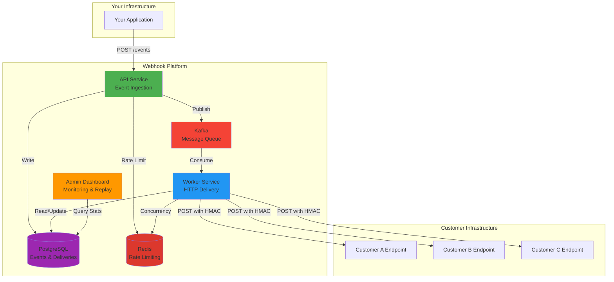
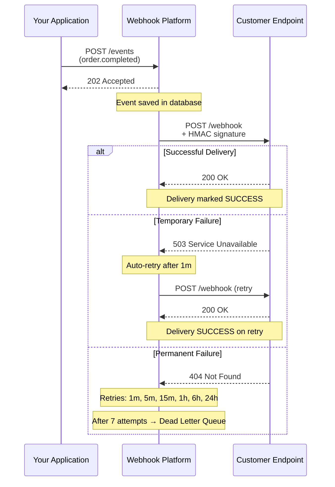

# Webhook Platform

[](https://github.com/vadymkykalo/webhook-platform/actions/workflows/ci.yml)
[](https://opensource.org/licenses/MIT)
[](https://www.docker.com/)
[]()
[]()
[]()
[]()
[]()

**Distributed webhook delivery platform** with at-least-once guarantees, automatic retries, and horizontal scaling.

<div align="center">
  
</div>

```bash
git clone https://github.com/vadymkykalo/webhook-platform.git && cd webhook-platform && make up
```

**UI**: http://localhost:5173 | **API Docs**: http://localhost:8080/swagger-ui.html

Self-hosted alternative to Svix/Hookdeck. Send events, get reliable delivery with retries, HMAC signatures, and full observability. Production-ready in 5 minutes.

## Requirements

| Dependency | Version | Notes |
|------------|---------|-------|
| **Docker** | 20.10+ | Container runtime |
| **Docker Compose** | v2.0+ (or v1.29+) | Service orchestration |
| **make** | any | Build automation |
| **git** | any | Clone repository |

> **Note**: All other dependencies (Java, PostgreSQL, Kafka, Redis) run inside Docker containers — no local installation needed.

## Architecture



## How It Works



**Retry strategy**: 7 attempts over ~31 hours (1m → 5m → 15m → 1h → 6h → 24h), then Dead Letter Queue.

## Features

| Category | Details |
|----------|---------|
| **Delivery** | Transactional outbox, at-least-once semantics, 30s timeout per attempt |
| **Retry** | Exponential backoff (1m to 24h), 7 attempts, DLQ for exhausted deliveries |
| **Security** | HMAC-SHA256 signatures, AES-GCM encrypted secrets, JWT auth, multi-tenant isolation |
| **Scale** | Redis rate limiting (100 req/s default), 12 Kafka partitions, stateless horizontal scaling |
| **Observability** | Prometheus metrics, delivery dashboard, attempt history with full request/response |

## SDKs

| Language | Install | Docs |
|----------|---------|------|
| **Node.js** | `npm install @webhook-platform/node` | [README](./sdks/node/README.md) |
| **Python** | `pip install webhook-platform` | [README](./sdks/python/README.md) |
| **PHP** | `composer require webhook-platform/php` | [README](./sdks/php/README.md) |

## Deployment

```bash
# Development
make up                    # Start all services
make down                  # Stop
make logs                  # View logs

# Production - edit .env first:
# APP_ENV=production
# WEBHOOK_ENCRYPTION_KEY=<32+ chars>
# JWT_SECRET=<32+ chars>
make up
```

Register at http://localhost:5173 or via API. Configuration: [`.env.dist`](./.env.dist)

## Commands

| Command | Description |
|---------|-------------|
| `make up` | Start all services |
| `make down` | Stop services |
| `make logs` | Follow logs |
| `make dev-api` | Rebuild + restart API |
| `make dev-worker` | Rebuild + restart Worker |
| `make dev-ui` | Rebuild + restart UI |
| `make backup-db` | Backup database |
| `make doctor` | Diagnostics |
| `make nuke CONFIRM=YES` | Delete everything |

## Contributing

Fork → branch → test → PR. All builds run in Docker (`make build`).
