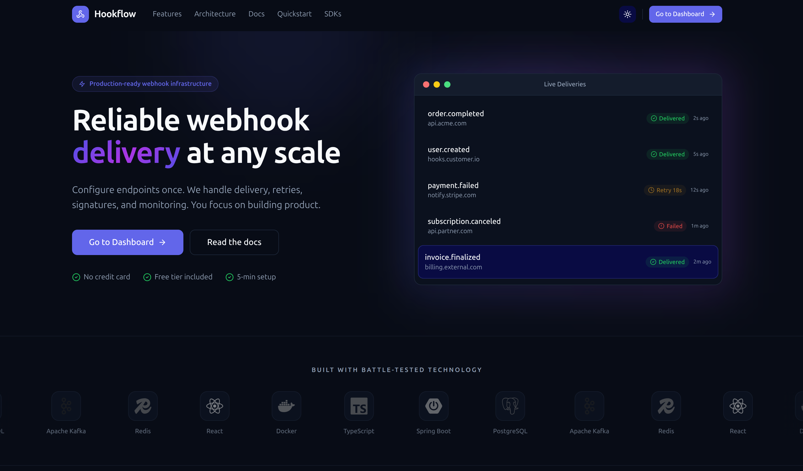
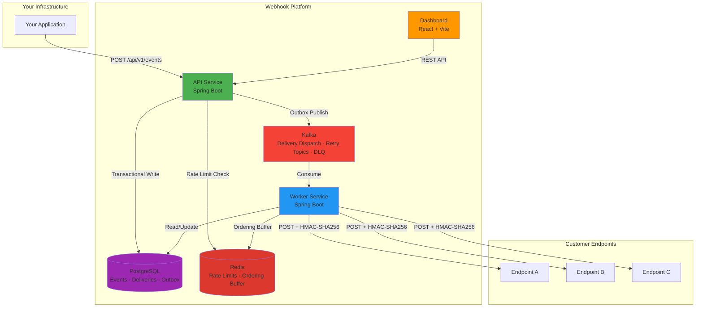
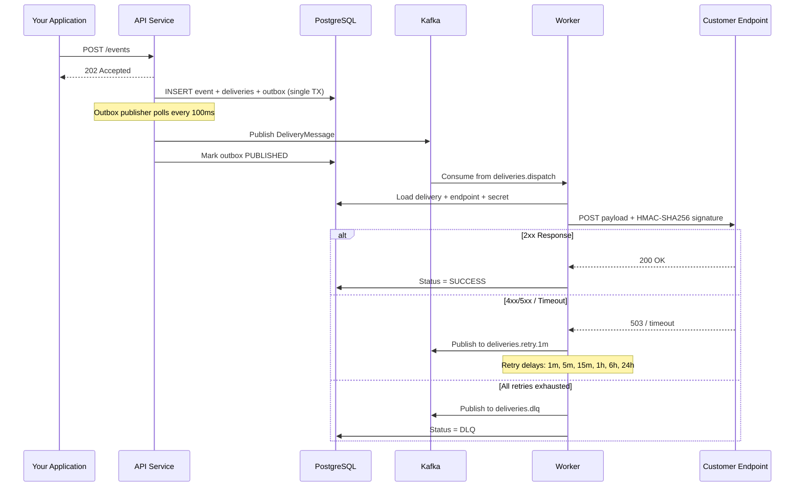

<div align="center">

# Webhook Platform

**Production-grade webhook delivery infrastructure you can self-host in 60 seconds.**

At-least-once delivery · FIFO ordering · Automatic retries · HMAC signatures · mTLS · Multi-tenant

[](https://github.com/vadymkykalo/webhook-platform/actions/workflows/ci.yml)
[](https://opensource.org/licenses/MIT)
[]()
[]()
[](https://www.docker.com/)

</div>

<div align="center">
  
</div>

<br>

<div align="center">

```bash
git clone https://github.com/vadymkykalo/webhook-platform.git && cd webhook-platform && make up
```

**Dashboard** → http://localhost:5173 &nbsp;|&nbsp; **API Docs** → http://localhost:8080/swagger-ui.html

</div>

---

## Why Webhook Platform?

Building reliable webhook delivery is deceptively hard. You need retries, ordering, signatures, rate limiting, dead letter queues, monitoring, and multi-tenancy — before writing a single line of business logic.

| | **Webhook Platform** | Svix | Hookdeck | DIY (cron + HTTP) |
|---|:---:|:---:|:---:|:---:|
| Self-hosted | Yes | Yes | No | Yes |
| At-least-once delivery | Yes | Yes | Yes | No |
| FIFO ordering | Yes | No | No | No |
| Automatic retries (6 tiers) | Yes | Yes | Yes | Manual |
| HMAC-SHA256 signatures | Yes | Yes | Yes | Manual |
| mTLS support | Yes | No | No | Manual |
| Built-in Request Bin | Yes | No | Yes | No |
| Admin Dashboard | Yes | Yes | Yes | No |
| Multi-tenant RBAC | Yes | Yes | No | No |
| Dead Letter Queue + Reprocessing | Yes | Yes | Yes | No |
| Free & open source | **MIT** | Enterprise | SaaS | — |

---

## Use Cases

<details>
<summary><b>E-commerce — Stripe / Shopify webhooks</b></summary>

```
Customer places order on Shopify
     |
Shopify sends webhook to your app
     |
Your app calls Webhook Platform API
     |
Platform delivers to:
  -> Inventory service (update stock)
  -> Email service (send confirmation)
  -> Analytics (record sale)
  -> Slack (notify team)
```

```bash
curl -X POST http://localhost:8080/api/v1/projects/{projectId}/events \
  -H "X-API-Key: YOUR_API_KEY" \
  -H "Content-Type: application/json" \
  -d '{
    "type": "order.completed",
    "payload": {
      "orderId": "ord_123",
      "amount": 99.99,
      "customer": "john@example.com"
    }
  }'
```
</details>

<details>
<summary><b>Payments — Fan-out to multiple services</b></summary>

```
Stripe payment.succeeded
     |
Webhook Platform
     |
  -> Fulfillment service (ship product)
  -> Accounting service (record revenue)
  -> CRM (update customer status)
  -> Slack #payments channel
```

One event, multiple reliable deliveries. Each endpoint gets independent retries, rate limiting, and delivery tracking.
</details>

<details>
<summary><b>CI/CD — GitHub / GitLab automation</b></summary>

```
GitHub push event
     |
Webhook Platform
     |
  -> Build server (trigger CI)
  -> Deploy service (staging deploy)
  -> Slack #deploys channel
```
</details>

<details>
<summary><b>Real-time data sync</b></summary>

```
CRM contact.updated
     |
Webhook Platform
     |
  -> Marketing platform (sync segments)
  -> Support tool (update ticket context)
  -> Data warehouse (ETL pipeline)
```
</details>

---

## Features

### Core Delivery Engine
- **Transactional outbox** — Kafka — at-least-once delivery (zero event loss)
- **FIFO ordering** per endpoint via Redis ordering buffer + sequence numbers
- **6-tier retry** with exponential backoff: 1m, 5m, 15m, 1h, 6h, 24h
- **Dead Letter Queue** with one-click reprocessing from dashboard
- **Circuit breaker** per endpoint — automatically pauses failing endpoints

### Security
- **HMAC-SHA256** signatures on every delivery
- **AES-256-GCM** encryption for endpoint secrets at rest
- **mTLS** — mutual TLS with per-endpoint client certificates
- **Endpoint verification** — challenge-response before first delivery
- **API key** authentication with project-level scoping and expiration

### Multi-tenancy & Access Control
- **Organizations** — **Projects** — **Endpoints** — **Subscriptions**
- **RBAC** with tenant isolation enforced via AOP
- **Audit logging** for all mutations

### Observability
- **Prometheus metrics** (`/actuator/prometheus`) — delivery latency, success rates, queue depths
- **Structured logging** with correlation IDs across all services
- **Per-delivery attempt tracking** — status codes, response times, error messages

### Developer Experience
- **Built-in Request Bin** — create test endpoints instantly from the dashboard
- **3 SDKs** — Node.js, Python, PHP with signature verification
- **Swagger UI** — interactive API documentation
- **`make doctor`** — pre-flight checks for production readiness

---

## Quick Start

**Prerequisites:** Docker 20.10+, Docker Compose v2+, `make`

### 1. Clone & Start

```bash
git clone https://github.com/vadymkykalo/webhook-platform.git
cd webhook-platform
make up
```

### 2. Register & Create API Key

Open http://localhost:5173, register an account, create a project, and generate an API key.

> **Note:** Email verification is logged to console in dev mode. Run `make verify-link` to get the link.

### 3. Create a Test Endpoint

In the dashboard, click **"+ New Endpoint"** — the platform generates a Request Bin URL automatically.

### 4. Send Your First Event

```bash
curl -X POST http://localhost:8080/api/v1/projects/{projectId}/events \
  -H "X-API-Key: YOUR_API_KEY" \
  -H "Content-Type: application/json" \
  -d '{
    "type": "user.signup",
    "payload": {
      "userId": "usr_42",
      "email": "jane@example.com",
      "plan": "pro"
    }
  }'
```

### 5. Watch It Deliver

Open the **Deliveries** tab in the dashboard to see real-time delivery status, response codes, and attempt history.

---

## Architecture


```mermaid
graph TB
    subgraph "Your Infrastructure"
        App[Your Application]
    end
    
    subgraph "Webhook Platform"
        UI[Dashboard<br/>React + Vite]
        API[API Service<br/>Spring Boot]
        DB[(PostgreSQL<br/>Events · Deliveries · Outbox)]
        Redis[(Redis<br/>Rate Limits · Ordering Buffer)]
        Kafka[Kafka<br/>Delivery Dispatch · Retry Topics · DLQ]
        Worker[Worker Service<br/>Spring Boot]
    end
    
    subgraph "Customer Endpoints"
        EP1[Endpoint A]
        EP2[Endpoint B]
        EP3[Endpoint C]
    end
    
    App -->|POST /api/v1/events| API
    UI  -->|REST API| API
    API -->|Rate Limit Check| Redis
    API -->|Transactional Write| DB
    API -->|Outbox Publish| Kafka
    Kafka -->|Consume| Worker
    Worker -->|Read/Update| DB
    Worker -->|Ordering Buffer| Redis
    Worker -->|POST + HMAC-SHA256| EP1
    Worker -->|POST + HMAC-SHA256| EP2
    Worker -->|POST + HMAC-SHA256| EP3
    
    style API fill:#4CAF50
    style Worker fill:#2196F3
    style UI fill:#FF9800
    style DB fill:#9C27B0
    style Kafka fill:#F44336
    style Redis fill:#DC382D
```

| Service | Port | Role |
|---------|------|------|
| **API** | `8080` | Event ingestion, REST API, outbox publisher |
| **Worker** | `8081` | Kafka consumer, HTTP delivery, retry scheduling |
| **UI** | `5173` | Admin dashboard (React / Vite / shadcn/ui) |
| **PostgreSQL** | `5432` | Persistent storage |
| **Kafka** | `9092` | Message broker (dispatch + 6 retry topics + DLQ) |
| **Redis** | `6379` | Rate limiting, FIFO ordering buffer |

### How Delivery Works


```mermaid
sequenceDiagram
    participant App as Your Application
    participant API as API Service
    participant DB as PostgreSQL
    participant Kafka as Kafka
    participant Worker as Worker
    participant EP as Customer Endpoint
    
    App->>API: POST /events
    API-->>App: 202 Accepted
    API->>DB: INSERT event + deliveries + outbox (single TX)
    
    Note over API: Outbox publisher polls every 100ms
    API->>Kafka: Publish DeliveryMessage
    API->>DB: Mark outbox PUBLISHED
    
    Kafka->>Worker: Consume from deliveries.dispatch
    Worker->>DB: Load delivery + endpoint + secret
    Worker->>EP: POST payload + HMAC-SHA256 signature
    
    alt 2xx Response
        EP-->>Worker: 200 OK
        Worker->>DB: Status = SUCCESS
    else 4xx/5xx / Timeout
        EP-->>Worker: 503 / timeout
        Worker->>Kafka: Publish to deliveries.retry.1m
        Note over Worker: Retry delays: 1m, 5m, 15m, 1h, 6h, 24h
    else All retries exhausted
        Worker->>Kafka: Publish to deliveries.dlq
        Worker->>DB: Status = DLQ
    end
```

---

## Verifying Signatures (Receiver Side)

Every webhook delivery includes an HMAC-SHA256 signature. Here's how to verify it:

<details>
<summary><b>Node.js</b></summary>

```javascript
import { Webhook } from '@webhook-platform/node';

const wh = new Webhook('whsec_your_endpoint_secret');

app.post('/webhooks', (req, res) => {
  try {
    const payload = wh.verify(req.body, req.headers);
    console.log('Verified event:', payload.type);
    res.json({ received: true });
  } catch (err) {
    res.status(400).json({ error: 'Invalid signature' });
  }
});
```
</details>

<details>
<summary><b>Python</b></summary>

```python
from webhook_platform import Webhook

wh = Webhook("whsec_your_endpoint_secret")

@app.post("/webhooks")
def handle_webhook(request):
    try:
        payload = wh.verify(request.body, request.headers)
        print(f"Verified event: {payload['type']}")
        return {"received": True}
    except Exception as e:
        return {"error": "Invalid signature"}, 400
```
</details>

<details>
<summary><b>PHP</b></summary>

```php
use WebhookPlatform\Webhook;

$wh = new Webhook('whsec_your_endpoint_secret');

try {
    $payload = $wh->verify($requestBody, $headers);
    echo "Verified event: " . $payload['type'];
} catch (\Exception $e) {
    http_response_code(400);
    echo json_encode(['error' => 'Invalid signature']);
}
```
</details>

---

## SDKs

| Language | Install | Docs |
|----------|---------|------|
| **Node.js** | `npm install @webhook-platform/node` | [README](./sdks/node/README.md) |
| **Python** | `pip install webhook-platform` | [README](./sdks/python/README.md) |
| **PHP** | `composer require webhook-platform/php` | [README](./sdks/php/README.md) |

All SDKs include signature verification, error handling, and typescript/type hints support.

---

## Deployment

### Development

```bash
make up              # Start all services (embedded PostgreSQL)
make up-external-db  # Start with external/managed DB
make down            # Stop (data preserved)
make logs            # Follow logs
make doctor          # Pre-flight checks
```

### Production

```bash
cp .env.dist .env    # Edit with real secrets
make up-prod         # Start with production overrides
make health          # Verify all services are UP
```

> **Before production:** Run `make doctor` to verify secrets, CORS, and security settings.

All environment variables are documented in [`.env.dist`](./.env.dist).

### Key Make Commands

```bash
make help                 # Full command list
make health               # Check all services
make backup-db            # Backup database to ./backups/
make restore-db FILE=...  # Restore from backup
make shell-db             # Open psql shell
make dev-api              # Quick rebuild API + tail logs
make verify-link          # Show email verification link from logs
make nuke CONFIRM=YES     # Destroy everything
```

---

## Roadmap

- [ ] Go SDK
- [ ] WebSocket / SSE — real-time delivery events in dashboard
- [ ] OpenTelemetry tracing — distributed tracing across all services
- [ ] Grafana dashboards — pre-built monitoring dashboards
- [ ] Webhook transformations — modify payloads before delivery
- [ ] Event replay — re-deliver historical events to new endpoints
- [ ] Rate limit per endpoint — granular throttling
- [ ] Custom retry strategies — configurable per subscription
- [ ] Terraform provider — infrastructure as code
- [ ] Kubernetes Helm chart — simplified K8s deployment

---

## Troubleshooting

<details>
<summary>Email verification in local development</summary>

By default, email sending is disabled (`EMAIL_ENABLED=false`). After registration, the verification link is printed to the API service logs:

```bash
make verify-link
```

Open the printed URL in a browser to confirm the account.
</details>

<details>
<summary>Endpoint creation fails with 500</summary>

If you're using the built-in test endpoint URL, make sure `TEST_ENDPOINT_BASE_URL` in `.env` matches your Docker service name. For default Docker Compose: `http://api:8080`.
</details>

<details>
<summary>Kafka topics not created</summary>

```bash
make up  # Automatically creates topics
# or manually:
docker exec webhook-kafka kafka-topics --create --topic deliveries.dispatch --partitions 12 --bootstrap-server localhost:9092
```
</details>

---

## Contributing

Contributions welcome. See [CONTRIBUTING.md](./CONTRIBUTING.md) for guidelines.

```
Fork → Branch → Test → PR
```

All CI checks must pass. See [SECURITY.md](./SECURITY.md) for vulnerability reporting.

## License

[MIT](./LICENSE) © Vadym Kykalo
