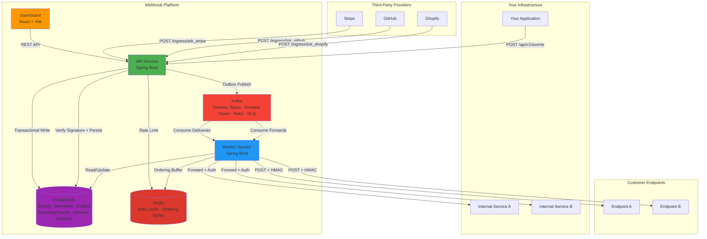
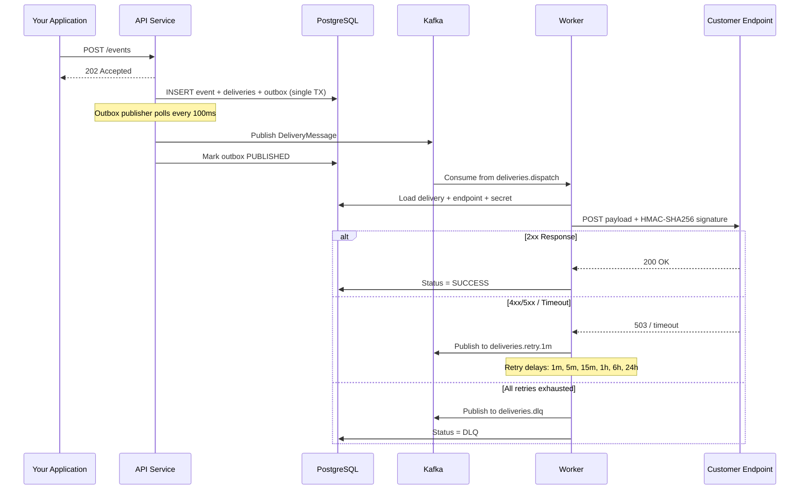
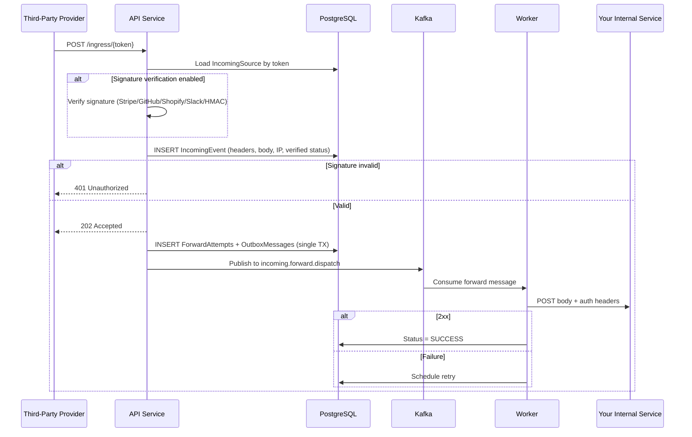

<div align="center">

# Webhook Platform

**Self-hosted webhook infrastructure. Outgoing delivery + incoming ingress.**

[](https://github.com/vadymkykalo/webhook-platform/actions/workflows/ci.yml)
[](https://opensource.org/licenses/MIT)
[]()
[]()
[](https://www.docker.com/)

```bash
git clone https://github.com/vadymkykalo/webhook-platform.git && cd webhook-platform && make up
```

**Dashboard** → http://localhost:5173 &nbsp;|&nbsp; **API Docs** → http://localhost:8080/swagger-ui.html

</div>

<div align="center">
  
</div>

---

## Quick Start

**Prerequisites:** Docker 20.10+, Docker Compose v2+, `make`

```bash
make up                   # Start everything
# Open http://localhost:5173, register, create project, get API key
make verify-link          # Get email verification link from logs
```

```bash
# Send your first event
curl -X POST http://localhost:8080/api/v1/projects/{projectId}/events \
  -H "X-API-Key: YOUR_API_KEY" \
  -H "Content-Type: application/json" \
  -d '{"type": "user.signup", "payload": {"userId": "usr_42"}}'
```

---

## Features

### Outgoing Delivery
- **Transactional outbox → Kafka** — at-least-once, zero event loss
- **FIFO ordering** per endpoint (Redis ordering buffer + sequence numbers)
- **6-tier retry** — 1m, 5m, 15m, 1h, 6h, 24h
- **DLQ** with one-click reprocess · **Circuit breaker** per endpoint
- **HMAC-SHA256** signatures · **mTLS** · **Endpoint verification** (challenge-response)

### Incoming Ingress
- **Public URLs** — `/ingress/{token}` per source, provider-specific signature verification
- **Built-in providers** — Stripe, GitHub, GitLab, Shopify, Slack + generic HMAC
- **Multi-destination forwarding** with auth (Bearer / Basic / custom header)
- **Payload transformation** — JSONPath · **Per-source rate limiting** · **Full audit trail**

### Platform
- **Schema Registry** — JSON Schema per event type, breaking change detection, WARN/BLOCK policies
- **Wildcard subscriptions** — `order.*`, `order.**`, `**`
- **Multi-tenancy** — Organizations → Projects → Endpoints, RBAC (Owner/Developer/Viewer)
- **AES-256-GCM** encryption for all secrets · **SSRF protection** · **API keys** with scoping
- **Prometheus metrics** · **Correlation IDs** · **Audit logging**
- **SDKs** — [Node.js](./sdks/node), [Python](./sdks/python), [PHP](./sdks/php) · **Request Bin** built-in

---

## Architecture


```mermaid
graph TB
    subgraph "Third-Party Providers"
        Stripe[Stripe]
        GitHub[GitHub]
        Shopify[Shopify]
    end

    subgraph "Your Infrastructure"
        App[Your Application]
        Svc1[Internal Service A]
        Svc2[Internal Service B]
    end
    
    subgraph "Webhook Platform"
        UI[Dashboard<br/>React + Vite]
        API[API Service<br/>Spring Boot]
        DB[(PostgreSQL<br/>Events · Deliveries · Outbox<br/>Incoming Events · Forward Attempts)]
        Redis[(Redis<br/>Rate Limits · Ordering Buffer)]
        Kafka[Kafka<br/>Delivery Topics · Forward Topics · Retry · DLQ]
        Worker[Worker Service<br/>Spring Boot]
    end
    
    subgraph "Customer Endpoints"
        EP1[Endpoint A]
        EP2[Endpoint B]
    end
    
    App -->|POST /api/v1/events| API
    UI  -->|REST API| API
    API -->|Transactional Write| DB
    API -->|Outbox Publish| Kafka
    Kafka -->|Consume Deliveries| Worker
    Worker -->|POST + HMAC| EP1
    Worker -->|POST + HMAC| EP2
    
    Stripe -->|POST /ingress/tok_stripe| API
    GitHub -->|POST /ingress/tok_github| API
    Shopify -->|POST /ingress/tok_shopify| API
    API -->|Verify Signature + Persist| DB
    Kafka -->|Consume Forwards| Worker
    Worker -->|Forward + Auth| Svc1
    Worker -->|Forward + Auth| Svc2
    
    API -->|Rate Limit| Redis
    Worker -->|Read/Update| DB
    Worker -->|Ordering Buffer| Redis
    
    style API fill:#4CAF50
    style Worker fill:#2196F3
    style UI fill:#FF9800
    style DB fill:#9C27B0
    style Kafka fill:#F44336
    style Redis fill:#DC382D
```

| Service | Port | Role |
|---------|------|------|
| **API** | `8080` | Event ingestion, webhook ingress, REST API, outbox publisher |
| **Worker** | `8081` | Kafka consumer, HTTP delivery, forwarding, retry scheduling |
| **UI** | `5173` | Admin dashboard (React / Vite / shadcn/ui) |
| **PostgreSQL** | `5432` | Events, deliveries, incoming events, outbox |
| **Kafka** | `9092` | Dispatch + 6 retry tiers + forward dispatch/retry + DLQ |
| **Redis** | `6379` | Rate limiting, FIFO ordering, circuit breaker |

### Outgoing Delivery Flow


```mermaid
sequenceDiagram
    participant App as Your Application
    participant API as API Service
    participant DB as PostgreSQL
    participant Kafka as Kafka
    participant Worker as Worker
    participant EP as Customer Endpoint
    
    App->>API: POST /events
    API-->>App: 202 Accepted
    API->>DB: INSERT event + deliveries + outbox (single TX)
    
    Note over API: Outbox publisher polls every 100ms
    API->>Kafka: Publish DeliveryMessage
    API->>DB: Mark outbox PUBLISHED
    
    Kafka->>Worker: Consume from deliveries.dispatch
    Worker->>DB: Load delivery + endpoint + secret
    Worker->>EP: POST payload + HMAC-SHA256 signature
    
    alt 2xx Response
        EP-->>Worker: 200 OK
        Worker->>DB: Status = SUCCESS
    else 4xx/5xx / Timeout
        EP-->>Worker: 503 / timeout
        Worker->>Kafka: Publish to deliveries.retry.1m
        Note over Worker: Retry delays: 1m, 5m, 15m, 1h, 6h, 24h
    else All retries exhausted
        Worker->>Kafka: Publish to deliveries.dlq
        Worker->>DB: Status = DLQ
    end
```

### Incoming Ingress Flow


```mermaid
sequenceDiagram
    participant Provider as Third-Party Provider
    participant API as API Service
    participant DB as PostgreSQL
    participant Kafka as Kafka
    participant Worker as Worker
    participant Dest as Your Internal Service

    Provider->>API: POST /ingress/{token}
    API->>DB: Load IncomingSource by token
    
    alt Signature verification enabled
        API->>API: Verify signature (Stripe/GitHub/Shopify/Slack/HMAC)
    end
    
    API->>DB: INSERT IncomingEvent (headers, body, IP, verified status)

    alt Signature invalid
        API-->>Provider: 401 Unauthorized
    else Valid
        API-->>Provider: 202 Accepted
        API->>DB: INSERT ForwardAttempts + OutboxMessages (single TX)
        API->>Kafka: Publish to incoming.forward.dispatch
        
        Kafka->>Worker: Consume forward message
        Worker->>Dest: POST body + auth headers
        
        alt 2xx
            Worker->>DB: Status = SUCCESS
        else Failure
            Worker->>DB: Schedule retry
        end
    end
```

### Signature Verification

| Provider | Header | Algorithm |
|----------|--------|-----------|
| **GitHub / GitLab** | `X-Hub-Signature-256` | HMAC-SHA256 |
| **Stripe** | `Stripe-Signature` | HMAC-SHA256 (timestamp + payload) |
| **Shopify** | `X-Shopify-Hmac-SHA256` | HMAC-SHA256 (Base64) |
| **Slack** | `X-Slack-Signature` | HMAC-SHA256 (v0:timestamp:body) |
| **Any provider** | Configurable | HMAC with configurable header/prefix |

---

## Deployment

### Development

```bash
make up              # Start all (embedded PostgreSQL)
make up-external-db  # External/managed DB
make down            # Stop (data preserved)
make logs            # Follow logs
make doctor          # Pre-flight checks
```

### Production

```bash
cp .env.dist .env    # Edit with real secrets
make up-prod         # Production overrides
make health          # Verify services
```

All env vars documented in [`.env.dist`](./.env.dist). Run `make doctor` before production.

### Key Commands

```bash
make health               # Check all services
make backup-db            # Backup database
make restore-db FILE=...  # Restore from backup
make shell-db             # Open psql shell
make dev-api              # Quick rebuild API + tail logs
make verify-link          # Email verification link (dev)
make reset-link           # Password reset link (dev)
make invite-link          # Member invite link (dev)
make nuke CONFIRM=YES     # Destroy everything
```

---

## Troubleshooting

<details>
<summary><b>Email/password/invite links in dev mode</b></summary>

With `EMAIL_ENABLED=false` (default), all links go to API logs:

```bash
make verify-link   # Email verification
make reset-link    # Password reset (expires in 1h)
make invite-link   # Member invite (expires in 48h)
```
</details>

<details>
<summary><b>Endpoint creation fails with 500</b></summary>

Set `TEST_ENDPOINT_BASE_URL=http://api:8080` in `.env` (must match Docker service name).
</details>

<details>
<summary><b>Kafka topics not created</b></summary>

```bash
make up  # Auto-creates topics
# or manually:
docker exec webhook-kafka kafka-topics --create --topic deliveries.dispatch --partitions 12 --bootstrap-server localhost:9092
```
</details>

---

## License

[MIT](./LICENSE) © Vadym Kykalo
