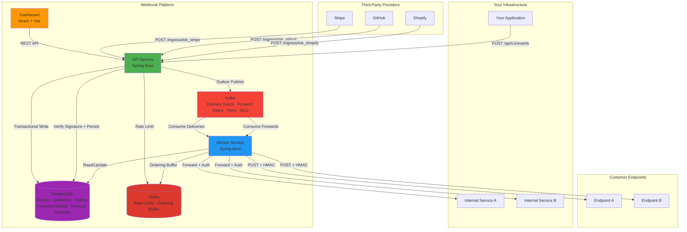
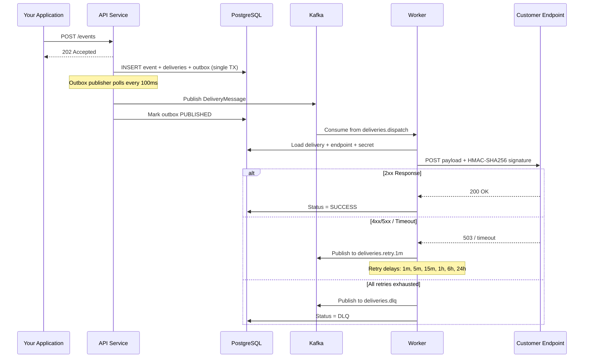
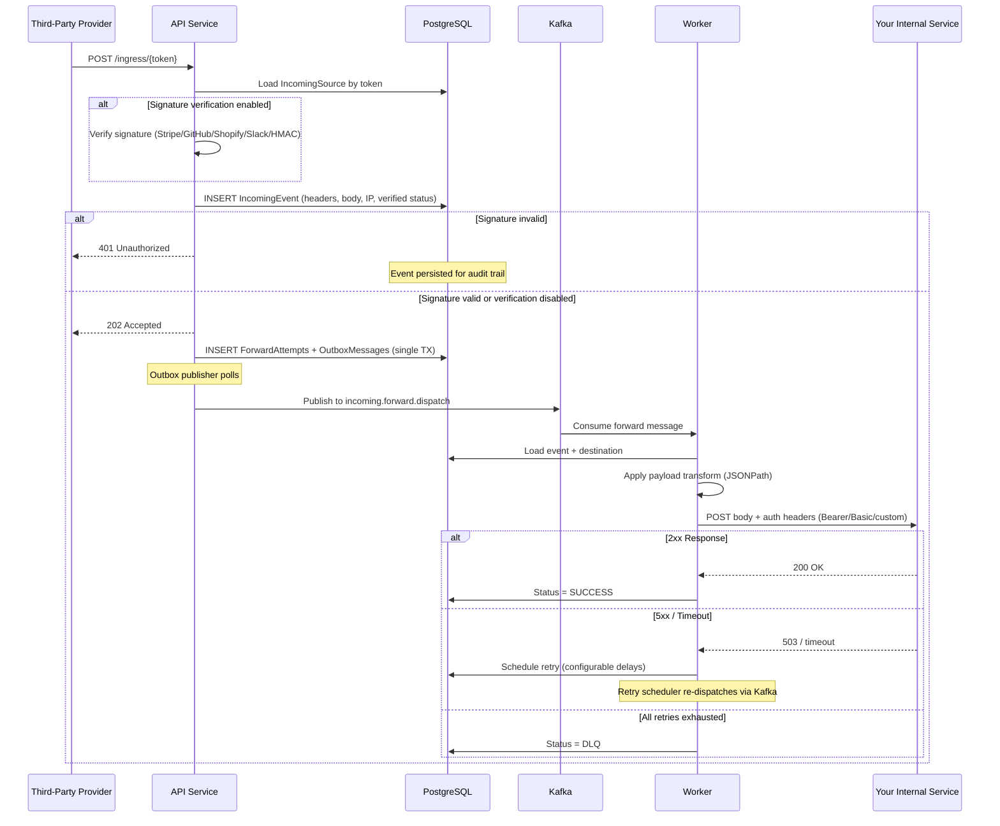

<div align="center">

# Webhook Platform

**Production-grade webhook infrastructure you can self-host in 60 seconds.**

Outgoing delivery · Incoming ingress · Signature verification · FIFO ordering · Automatic retries · mTLS · Multi-tenant

[](https://github.com/vadymkykalo/webhook-platform/actions/workflows/ci.yml)
[](https://opensource.org/licenses/MIT)
[]()
[]()
[](https://www.docker.com/)

</div>

<div align="center">
  
</div>

<br>

<div align="center">

```bash
git clone https://github.com/vadymkykalo/webhook-platform.git && cd webhook-platform && make up
```

**Dashboard** → http://localhost:5173 &nbsp;|&nbsp; **API Docs** → http://localhost:8080/swagger-ui.html

</div>

---

## Why Webhook Platform?

Building reliable webhook infrastructure is harder than it looks — both **sending** and **receiving**. Retries, ordering, signatures, rate limiting, dead letter queues, provider-specific verification, forwarding to multiple destinations — that's a lot of plumbing before you write a single line of business logic.

There are great commercial solutions like [Svix](https://www.svix.com/) and [Hookdeck](https://hookdeck.com/) that solve parts of this well. Webhook Platform is a fully open-source, MIT-licensed alternative you can self-host and own entirely. It handles both directions: **outgoing delivery** (fan-out to customer endpoints) and **incoming ingress** (receive from third-party providers, verify, and forward). It includes FIFO ordering, mTLS, provider-specific signature verification, payload transformation, a built-in request bin, and a multi-tenant admin dashboard out of the box.

---

## Use Cases

### Outgoing — Deliver webhooks to your customers

<details>
<summary><b>E-commerce — Fan-out order events</b></summary>

```
Customer places order in your app
     |
Your app calls Webhook Platform API
     |
Platform delivers to customer endpoints:
  -> Inventory service (update stock)
  -> Email service (send confirmation)
  -> Analytics (record sale)
  -> Slack (notify team)
```

```bash
curl -X POST http://localhost:8080/api/v1/projects/{projectId}/events \
  -H "X-API-Key: YOUR_API_KEY" \
  -H "Content-Type: application/json" \
  -d '{
    "type": "order.completed",
    "payload": {
      "orderId": "ord_123",
      "amount": 99.99,
      "customer": "john@example.com"
    }
  }'
```

One event, multiple reliable deliveries. Each endpoint gets independent retries, rate limiting, and delivery tracking.
</details>

<details>
<summary><b>CI/CD — GitHub / GitLab automation</b></summary>

```
GitHub push event → Your app → Webhook Platform
     |
  -> Build server (trigger CI)
  -> Deploy service (staging deploy)
  -> Slack #deploys channel
```
</details>

### Incoming — Receive webhooks from third-party providers

<details>
<summary><b>Stripe / Shopify / GitHub → Your services</b></summary>

```
Stripe sends payment.succeeded
     |
POST /ingress/{token}   ← public URL, no auth needed
     |
Webhook Platform:
  1. Verify Stripe signature (provider-specific)
  2. Persist raw event for audit
  3. Forward to your destinations:
     -> Payment service (fulfill order)
     -> Accounting API (record revenue)
     -> Slack #payments (notify team)
```

Each destination gets independent retries, auth headers (Bearer/Basic/custom), payload transformation, and SSRF protection.
</details>

<details>
<summary><b>Multi-provider aggregation</b></summary>

```
GitHub    ──┐
Stripe    ──┤ Each provider gets its own
Shopify   ──┤ /ingress/{token} URL with
Slack     ──┘ provider-specific signature verification
     |
Webhook Platform verifies + normalizes
     |
  -> Your unified event processing pipeline
  -> Data warehouse (raw event archive)
  -> Alerting service
```

One platform to receive from all providers. Each incoming source has its own ingress URL, verification mode, rate limits, and forwarding destinations.
</details>

---

## Features

### Outgoing — Core Delivery Engine
- **Transactional outbox** — Kafka — at-least-once delivery (zero event loss)
- **FIFO ordering** per endpoint via Redis ordering buffer + sequence numbers
- **6-tier retry** with exponential backoff: 1m, 5m, 15m, 1h, 6h, 24h
- **Dead Letter Queue** with one-click reprocessing from dashboard
- **Circuit breaker** per endpoint — automatically pauses failing endpoints

### Incoming — Webhook Ingress Engine
- **Public ingress URLs** — unique `/ingress/{token}` per source, no auth required for providers
- **Provider-specific signature verification** — built-in support for Stripe, GitHub, GitLab, Shopify, Slack
- **Generic HMAC verification** — configurable header name, prefix, and algorithm for any provider
- **Multi-destination forwarding** — fan-out each incoming event to multiple internal services
- **Forwarding auth** — Bearer, Basic, or custom header authentication per destination
- **Payload transformation** — JSONPath expressions to extract/reshape payloads before forwarding
- **Per-source rate limiting** — protect your pipeline from provider bursts
- **Full audit trail** — every incoming request persisted with headers, body, IP, verification status
- **Retry with backoff** — configurable per-destination retry delays and max attempts

### Security
- **HMAC-SHA256** signatures on every outgoing delivery
- **Incoming signature verification** — strategy pattern supporting 5+ providers
- **AES-256-GCM** encryption for all secrets at rest (endpoint secrets, HMAC keys, auth configs)
- **mTLS** — mutual TLS with per-endpoint client certificates
- **Endpoint verification** — challenge-response before first delivery
- **SSRF protection** — URL validation on both outgoing deliveries and incoming forwarding
- **API key** authentication with project-level scoping and expiration
- **Production safety validator** — startup guardrails prevent dev defaults in production

### Multi-tenancy & Access Control
- **Organizations** — **Projects** — **Endpoints** — **Subscriptions**
- **RBAC** with tenant isolation enforced via AOP
- **Audit logging** for all mutations

### Observability
- **Prometheus metrics** (`/actuator/prometheus`) — delivery latency, success rates, queue depths
- **Structured logging** with correlation IDs across all services
- **Per-delivery attempt tracking** — status codes, response times, error messages

### Developer Experience
- **Built-in Request Bin** — create test endpoints instantly from the dashboard
- **3 SDKs** — Node.js, Python, PHP with signature verification
- **Swagger UI** — interactive API documentation
- **`make doctor`** — pre-flight checks for production readiness

---

## Quick Start

**Prerequisites:** Docker 20.10+, Docker Compose v2+, `make`

### 1. Clone & Start

```bash
git clone https://github.com/vadymkykalo/webhook-platform.git
cd webhook-platform
make up
```

### 2. Register & Create API Key

Open http://localhost:5173, register an account, create a project, and generate an API key.

> **Note:** Email verification is logged to console in dev mode. Run `make verify-link` to get the link.

### 3. Create a Test Endpoint

In the dashboard, click **"+ New Endpoint"** — the platform generates a Request Bin URL automatically.

### 4. Send Your First Event

```bash
curl -X POST http://localhost:8080/api/v1/projects/{projectId}/events \
  -H "X-API-Key: YOUR_API_KEY" \
  -H "Content-Type: application/json" \
  -d '{
    "type": "user.signup",
    "payload": {
      "userId": "usr_42",
      "email": "jane@example.com",
      "plan": "pro"
    }
  }'
```

### 5. Watch It Deliver

Open the **Deliveries** tab in the dashboard to see real-time delivery status, response codes, and attempt history.

---

## Architecture


```mermaid
graph TB
    subgraph "Third-Party Providers"
        Stripe[Stripe]
        GitHub[GitHub]
        Shopify[Shopify]
    end

    subgraph "Your Infrastructure"
        App[Your Application]
        Svc1[Internal Service A]
        Svc2[Internal Service B]
    end
    
    subgraph "Webhook Platform"
        UI[Dashboard<br/>React + Vite]
        API[API Service<br/>Spring Boot]
        DB[(PostgreSQL<br/>Events · Deliveries · Outbox<br/>Incoming Events · Forward Attempts)]
        Redis[(Redis<br/>Rate Limits · Ordering Buffer)]
        Kafka[Kafka<br/>Delivery Topics · Forward Topics · Retry · DLQ]
        Worker[Worker Service<br/>Spring Boot]
    end
    
    subgraph "Customer Endpoints"
        EP1[Endpoint A]
        EP2[Endpoint B]
    end
    
    %% Outgoing flow
    App -->|POST /api/v1/events| API
    UI  -->|REST API| API
    API -->|Transactional Write| DB
    API -->|Outbox Publish| Kafka
    Kafka -->|Consume Deliveries| Worker
    Worker -->|POST + HMAC| EP1
    Worker -->|POST + HMAC| EP2
    
    %% Incoming flow
    Stripe -->|POST /ingress/tok_stripe| API
    GitHub -->|POST /ingress/tok_github| API
    Shopify -->|POST /ingress/tok_shopify| API
    API -->|Verify Signature + Persist| DB
    Kafka -->|Consume Forwards| Worker
    Worker -->|Forward + Auth| Svc1
    Worker -->|Forward + Auth| Svc2
    
    %% Shared infra
    API -->|Rate Limit| Redis
    Worker -->|Read/Update| DB
    Worker -->|Ordering Buffer| Redis
    
    style API fill:#4CAF50
    style Worker fill:#2196F3
    style UI fill:#FF9800
    style DB fill:#9C27B0
    style Kafka fill:#F44336
    style Redis fill:#DC382D
```

| Service | Port | Role |
|---------|------|------|
| **API** | `8080` | Outgoing event ingestion, incoming webhook ingress, REST API, outbox publisher |
| **Worker** | `8081` | Kafka consumer, outgoing HTTP delivery, incoming forwarding, retry scheduling |
| **UI** | `5173` | Admin dashboard (React / Vite / shadcn/ui) |
| **PostgreSQL** | `5432` | Events, deliveries, incoming events, forward attempts, outbox |
| **Kafka** | `9092` | Delivery dispatch + 6 retry topics + incoming forward dispatch/retry |
| **Redis** | `6379` | Rate limiting, FIFO ordering buffer, circuit breaker state |

### How Outgoing Delivery Works


```mermaid
sequenceDiagram
    participant App as Your Application
    participant API as API Service
    participant DB as PostgreSQL
    participant Kafka as Kafka
    participant Worker as Worker
    participant EP as Customer Endpoint
    
    App->>API: POST /events
    API-->>App: 202 Accepted
    API->>DB: INSERT event + deliveries + outbox (single TX)
    
    Note over API: Outbox publisher polls every 100ms
    API->>Kafka: Publish DeliveryMessage
    API->>DB: Mark outbox PUBLISHED
    
    Kafka->>Worker: Consume from deliveries.dispatch
    Worker->>DB: Load delivery + endpoint + secret
    Worker->>EP: POST payload + HMAC-SHA256 signature
    
    alt 2xx Response
        EP-->>Worker: 200 OK
        Worker->>DB: Status = SUCCESS
    else 4xx/5xx / Timeout
        EP-->>Worker: 503 / timeout
        Worker->>Kafka: Publish to deliveries.retry.1m
        Note over Worker: Retry delays: 1m, 5m, 15m, 1h, 6h, 24h
    else All retries exhausted
        Worker->>Kafka: Publish to deliveries.dlq
        Worker->>DB: Status = DLQ
    end
```

### How Incoming Ingress Works


```mermaid
sequenceDiagram
    participant Provider as Third-Party Provider
    participant API as API Service
    participant DB as PostgreSQL
    participant Kafka as Kafka
    participant Worker as Worker
    participant Dest as Your Internal Service

    Provider->>API: POST /ingress/{token}
    
    API->>DB: Load IncomingSource by token
    
    alt Signature verification enabled
        API->>API: Verify signature (Stripe/GitHub/Shopify/Slack/HMAC)
    end
    
    API->>DB: INSERT IncomingEvent (headers, body, IP, verified status)

    alt Signature invalid
        API-->>Provider: 401 Unauthorized
        Note over DB: Event persisted for audit trail
    else Signature valid or verification disabled
        API-->>Provider: 202 Accepted
        API->>DB: INSERT ForwardAttempts + OutboxMessages (single TX)
        
        Note over API: Outbox publisher polls
        API->>Kafka: Publish to incoming.forward.dispatch
        
        Kafka->>Worker: Consume forward message
        Worker->>DB: Load event + destination
        Worker->>Worker: Apply payload transform (JSONPath)
        Worker->>Dest: POST body + auth headers (Bearer/Basic/custom)
        
        alt 2xx Response
            Dest-->>Worker: 200 OK
            Worker->>DB: Status = SUCCESS
        else 5xx / Timeout
            Dest-->>Worker: 503 / timeout
            Worker->>DB: Schedule retry (configurable delays)
            Note over Worker: Retry scheduler re-dispatches via Kafka
        else All retries exhausted
            Worker->>DB: Status = DLQ
        end
    end
```

### Supported Signature Verification

| Provider | Header | Algorithm | Mode |
|----------|--------|-----------|------|
| **GitHub / GitLab** | `X-Hub-Signature-256` | HMAC-SHA256 | `PROVIDER` |
| **Stripe** | `Stripe-Signature` | HMAC-SHA256 (timestamp + payload) | `PROVIDER` |
| **Shopify** | `X-Shopify-Hmac-SHA256` | HMAC-SHA256 (Base64) | `PROVIDER` |
| **Slack** | `X-Slack-Signature` | HMAC-SHA256 (v0:timestamp:body) | `PROVIDER` |
| **Any provider** | _Configurable_ | HMAC with configurable prefix | `HMAC_GENERIC` |
| **No verification** | — | — | `NONE` |

---

## Verifying Signatures (Receiver Side)

Every webhook delivery includes an HMAC-SHA256 signature. Here's how to verify it:

<details>
<summary><b>Node.js</b></summary>

```javascript
import { Webhook } from '@webhook-platform/node';

const wh = new Webhook('whsec_your_endpoint_secret');

app.post('/webhooks', (req, res) => {
  try {
    const payload = wh.verify(req.body, req.headers);
    console.log('Verified event:', payload.type);
    res.json({ received: true });
  } catch (err) {
    res.status(400).json({ error: 'Invalid signature' });
  }
});
```
</details>

<details>
<summary><b>Python</b></summary>

```python
from webhook_platform import Webhook

wh = Webhook("whsec_your_endpoint_secret")

@app.post("/webhooks")
def handle_webhook(request):
    try:
        payload = wh.verify(request.body, request.headers)
        print(f"Verified event: {payload['type']}")
        return {"received": True}
    except Exception as e:
        return {"error": "Invalid signature"}, 400
```
</details>

<details>
<summary><b>PHP</b></summary>

```php
use WebhookPlatform\Webhook;

$wh = new Webhook('whsec_your_endpoint_secret');

try {
    $payload = $wh->verify($requestBody, $headers);
    echo "Verified event: " . $payload['type'];
} catch (\Exception $e) {
    http_response_code(400);
    echo json_encode(['error' => 'Invalid signature']);
}
```
</details>

---

## SDKs

| Language | Install | Docs |
|----------|---------|------|
| **Node.js** | `npm install @webhook-platform/node` | [README](./sdks/node/README.md) |
| **Python** | `pip install webhook-platform` | [README](./sdks/python/README.md) |
| **PHP** | `composer require webhook-platform/php` | [README](./sdks/php/README.md) |

All SDKs include signature verification, error handling, and typescript/type hints support.

---

## Incoming Webhooks — API Usage

Set up incoming webhook ingress in 3 steps via the REST API (or through the dashboard).

### Step 1: Create an Incoming Source

```bash
curl -X POST http://localhost:8080/api/v1/projects/{projectId}/incoming-sources \
  -H "Authorization: Bearer YOUR_JWT_TOKEN" \
  -H "Content-Type: application/json" \
  -d '{
    "name": "Stripe Payments",
    "providerType": "STRIPE",
    "verificationMode": "PROVIDER",
    "hmacSecret": "whsec_your_stripe_webhook_secret",
    "rateLimitPerSecond": 100
  }'
```

Response includes the **ingress URL** — give this to the provider:

```json
{
  "id": "550e8400-e29b-41d4-a716-446655440000",
  "name": "Stripe Payments",
  "providerType": "STRIPE",
  "verificationMode": "PROVIDER",
  "ingressUrl": "http://localhost:8080/ingress/tok_a1b2c3d4e5f6",
  "ingressPathToken": "tok_a1b2c3d4e5f6",
  "hmacSecretConfigured": true,
  "status": "ACTIVE"
}
```

### Step 2: Add Forwarding Destinations

```bash
curl -X POST http://localhost:8080/api/v1/projects/{projectId}/incoming-sources/{sourceId}/destinations \
  -H "Authorization: Bearer YOUR_JWT_TOKEN" \
  -H "Content-Type: application/json" \
  -d '{
    "name": "Payment Processing Service",
    "url": "https://internal-api.example.com/webhooks/stripe",
    "authType": "BEARER",
    "authConfig": { "token": "internal_service_token" },
    "payloadTransform": "$.data.object",
    "maxAttempts": 5,
    "retryDelays": "60,300,900,3600,21600"
  }'
```

**Auth types:** `NONE`, `BEARER`, `BASIC`, `CUSTOM_HEADER`
**Payload transform:** JSONPath expression to extract/reshape the body before forwarding

### Step 3: Configure Provider Webhook URL

Point your provider (Stripe, GitHub, etc.) to the ingress URL:

```
https://your-domain.com/ingress/tok_a1b2c3d4e5f6
```

That's it. Every webhook received at this URL will be:
1. **Verified** against the provider's signature
2. **Persisted** with full request metadata for audit
3. **Forwarded** to all enabled destinations with retries

### Verification Modes

| Mode | Use when |
|------|----------|
| `PROVIDER` | Using a supported provider (Stripe, GitHub, GitLab, Shopify, Slack) — signature format auto-detected |
| `HMAC_GENERIC` | Any provider that sends HMAC signatures — configure `hmacHeaderName` and `hmacSignaturePrefix` |
| `NONE` | No signature verification (testing or trusted internal sources only) |

**Generic HMAC example** (custom provider):

```bash
curl -X POST http://localhost:8080/api/v1/projects/{projectId}/incoming-sources \
  -H "Authorization: Bearer YOUR_JWT_TOKEN" \
  -H "Content-Type: application/json" \
  -d '{
    "name": "Custom Provider",
    "providerType": "CUSTOM",
    "verificationMode": "HMAC_GENERIC",
    "hmacSecret": "my_webhook_secret",
    "hmacHeaderName": "X-Webhook-Signature",
    "hmacSignaturePrefix": "sha256="
  }'
```

---

## Deployment

### Development

```bash
make up              # Start all services (embedded PostgreSQL)
make up-external-db  # Start with external/managed DB
make down            # Stop (data preserved)
make logs            # Follow logs
make doctor          # Pre-flight checks
```

### Production

```bash
cp .env.dist .env    # Edit with real secrets
make up-prod         # Start with production overrides
make health          # Verify all services are UP
```

> **Before production:** Run `make doctor` to verify secrets, CORS, and security settings.

All environment variables are documented in [`.env.dist`](./.env.dist).

### Key Make Commands

```bash
make help                 # Full command list
make health               # Check all services
make backup-db            # Backup database to ./backups/
make restore-db FILE=...  # Restore from backup
make shell-db             # Open psql shell
make dev-api              # Quick rebuild API + tail logs
make verify-link          # Show email verification link from logs
make reset-link           # Show password reset link from logs
make invite-link          # Show member invite link from logs
make nuke CONFIRM=YES     # Destroy everything
```

---

## Troubleshooting

<details>
<summary>Email verification in local development</summary>

By default, email sending is disabled (`EMAIL_ENABLED=false`). After registration, the verification link is printed to the API service logs:

```bash
make verify-link
```

Open the printed URL in a browser to confirm the account.
</details>

<details>
<summary>Forgot password in local development</summary>

Password reset emails also go to the API logs when `EMAIL_ENABLED=false`. After requesting a reset on the `/forgot-password` page:

```bash
make reset-link
```

Open the printed URL in a browser to set a new password. The link expires in 1 hour.
</details>

<details>
<summary>Member invite in local development</summary>

When an OWNER adds a new member via the Members page, an invite link is printed to the API logs (when `EMAIL_ENABLED=false`).

```bash
make invite-link
```

The invite flow:
1. OWNER adds member by email on the Members page → membership created with `INVITED` status
2. New user account is auto-created with a temporary password (logged server-side)
3. Invite link is logged to API console — grab it with `make invite-link`
4. Open the link in a browser while logged in as the invited user → status changes to `ACTIVE`

The invite token expires in 48 hours. If it expires, the OWNER must remove and re-add the member.
</details>

<details>
<summary>Endpoint creation fails with 500</summary>

If you're using the built-in test endpoint URL, make sure `TEST_ENDPOINT_BASE_URL` in `.env` matches your Docker service name. For default Docker Compose: `http://api:8080`.
</details>

<details>
<summary>Kafka topics not created</summary>

```bash
make up  # Automatically creates topics
# or manually:
docker exec webhook-kafka kafka-topics --create --topic deliveries.dispatch --partitions 12 --bootstrap-server localhost:9092
```
</details>

---

## Contributing

Contributions welcome. See [CONTRIBUTING.md](./CONTRIBUTING.md) for guidelines.

```
Fork → Branch → Test → PR
```

All CI checks must pass. See [SECURITY.md](./SECURITY.md) for vulnerability reporting.

## License

[MIT](./LICENSE) © Vadym Kykalo
