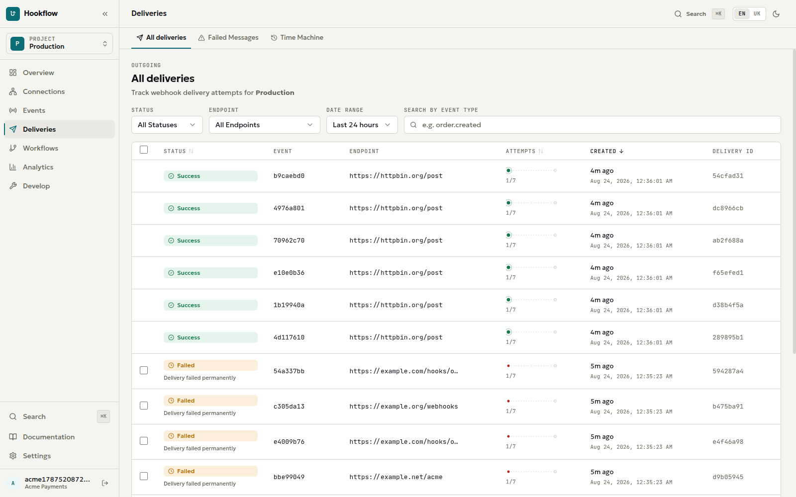

<div align="center">

# Hookflow

**Self-hosted webhook infrastructure. Outgoing delivery + incoming ingress.**

[](https://github.com/vadymkykalo/webhook-platform/actions/workflows/ci.yml)
[](https://github.com/vadymkykalo/webhook-platform/releases/latest)
[](https://opensource.org/licenses/MIT)
[](https://openjdk.org/projects/jdk/17/)
[](https://spring.io/projects/spring-boot)
[](https://www.docker.com/)
[](https://github.com/vadymkykalo?tab=packages&repo_name=webhook-platform)

```bash
curl -fsSL https://raw.githubusercontent.com/vadymkykalo/webhook-platform/main/install.sh | bash
```

Checks the machine, writes a Compose file pinned to the latest release and a
`.env` with freshly generated secrets, and starts the stack. No clone, no
config to write, no secrets to invent.

**Open → http://localhost** &nbsp;·&nbsp; register, and you are in the dashboard.

</div>

<div align="center">
  
  <p><em>Deliveries — every attempt on the record, with the retry ladder each one is on.</em></p>
  <p><sub><a href="docs/screenshots/">More screenshots</a> · <a href="docs/DEMO.md">a public demo is planned, not deployed</a></sub></p>
</div>

---

**[Quick start](#quick-start)** ·
**[What it does](#what-it-does)** ·
**[Architecture](#architecture)** ·
**[API & SDKs](#api-reference--sdks)** ·
**[Documentation](#documentation)** ·
**[Roadmap](./ROADMAP.md)** ·
**[Changelog](./CHANGELOG.md)** ·
**[Contributing](#contributing)**

---

## Quick Start

**Prerequisites:** Docker 20.10+, Compose v2, ~4 GB of RAM. The images are
[multi-arch](https://github.com/vadymkykalo?tab=packages&repo_name=webhook-platform),
so nothing is compiled on your machine.

The installer above refuses to start until Docker, memory, disk and the port
all check out, and verifies the configuration it wrote before starting
anything. Open **http://localhost**, register, create a project — nothing is
gated behind a verification email you never receive. Pass
`-s -- --dir /opt/hookflow --port 8080` to put it elsewhere.

```bash
# Send your first event, with the API key the dashboard just gave you.
# The key already says which project this is, so the path carries no id.
curl -X POST http://localhost/api/v1/events \
  -H "X-API-Key: YOUR_API_KEY" \
  -H "Content-Type: application/json" \
  -d '{"type": "user.signup", "data": {"userId": "usr_42"}}'
```

**One published port.** nginx serves the dashboard and proxies every API path
to the backend, so there is a single URL to hand out, a single certificate to
obtain and a single firewall rule to write. Postgres, Kafka, Redis and the API
itself are reachable only from inside the Docker network.

### On a domain, with HTTPS

Point the A record at the server, then:

```bash
curl -fsSL .../install.sh | bash -s -- --domain hooks.example.com --email ops@example.com
```

That brings up a TLS terminator which obtains and renews the certificate itself
— no cron entry, no renewal hook — moves the dashboard behind it onto loopback,
and switches the platform to production mode, where it refuses to start on
unsafe configuration rather than running with it.

### Day two

```bash
cd ~/hookflow
./hookflow status | logs | stop | start | backup | doctor
```

`doctor` re-runs the machine and configuration checks against what is on disk,
so a hand-edited `.env` gets caught before it becomes a support question. `.env`
holds your secrets — **back it up**: `WEBHOOK_ENCRYPTION_KEY` is what every
endpoint secret in the database is encrypted with, and a database backup
without it restores rows nothing can read.

To remove it: `... install.sh | bash -s -- --uninstall` keeps your data,
`--purge` deletes it.

### Running it from a clone

```bash
git clone https://github.com/vadymkykalo/webhook-platform.git && cd webhook-platform
make up      # builds the three services from your tree, writes .env, creates the topics
make help    # everything else
```

Same one-port shape as an installed deployment, on **http://localhost:8080** —
nothing you learn here stops working when you deploy.
[`CONTRIBUTING.md`](./CONTRIBUTING.md) has the test commands CI runs and what
each build guard means when it fails.

---

## What it does

**Outgoing** — your system announces an event; Hookflow gets it to every endpoint
your customers registered. Written to a transactional outbox in the same
statement as the work itself, so an event cannot be accepted and then lost.
Signed with HMAC-SHA256, ordered per endpoint, retried on a six-rung ladder
(1m → 24h), and parked in a DLQ for a human once the ladder runs out. Every
attempt is on the record with the response it got.

**Incoming** — a provider posts to a URL you own; Hookflow verifies the
signature and forwards it to the destinations you nominated. Stripe, GitHub,
GitLab, Shopify, Slack and Twilio are understood out of the box, plus generic
HMAC for anything else.

Both directions run the same claim → send → classify → finalise loop, so a fix
to attempt behaviour lands once rather than twice.

### Everything in the box

| | |
|---|---|
| **Delivery** | Six-rung retry ladder · per-endpoint FIFO ordering · rate limits and concurrency caps · shared circuit breaker · 96h hard cap |
| **Recovery** | Failed Messages with bulk requeue · Time Machine replay that builds *fresh* deliveries, not re-sends |
| **Signing** | HMAC-SHA256 in two schemes at once, including [Standard Webhooks](https://github.com/standard-webhooks/standard-webhooks) · secret rotation with an overlap window |
| **Shaping** | Rules engine · JSONPath transformations · schema registry with compatibility modes · wildcard subscriptions · workflow builder |
| **Incoming** | Stripe, GitHub, GitLab, Shopify, Slack, Twilio and generic HMAC · deduplication · authenticated forwarding |
| **Developing** | CLI tunnel to `localhost` · disposable receiving endpoints · transformation preview and delivery dry-run |
| **Security** | Row-level tenant isolation · AES-256-GCM with key rotation · SSRF protection · mTLS · PII masking · audit log |
| **Operating** | Prometheus metrics, 4 dashboards, 13 alert rules · configurable retention · GDPR export · CI-tested restore drill |

Organizations → Projects → Endpoints, with Owner / Developer / Viewer roles.
Nothing is gated — see [Is this really MIT?](#is-this-really-mit-what-is-the-billing-code-doing-here)
Honest comparison against Svix, Hookdeck and Convoy, gaps included:
[`docs/guides/comparison.md`](docs/guides/comparison.md).

## Architecture

The write path never publishes to Kafka directly: work and its announcement go
into a transactional outbox in the same statement, so they cannot disagree. The
worker consumes, attempts delivery, and reschedules onto one of six delay
topics that make up the retry ladder.

```
Outgoing   your app ──▶ api ──▶ outbox (same txn) ──▶ Kafka ──▶ worker ──▶ endpoint
                                                        ▲                     │
                                                        └─── retry ladder ◀───┘
                                                        1m 5m 15m 1h 6h 24h → DLQ

Incoming   provider ──▶ /ingress/{token} ──▶ verify signature ──▶ Kafka ──▶ worker ──▶ destination
```

**[`docs/ARCHITECTURE.md`](docs/ARCHITECTURE.md)** goes the rest of the way:
fourteen diagrams covering the data model, the claim and its fence token, the
admission order, the delivery state machine, ordering and gaps, tenancy and the
production topology — plus the consistency model, the partitioning and the
failure modes in prose. **[`CONTEXT.md`](CONTEXT.md)** is the vocabulary all of
it uses.


## API Reference & SDKs

- **In-app docs** — the dashboard's [Documentation page](webhook-platform-ui/src/pages/DocumentationPage.tsx) has prose, concepts and per-language quick-start samples for every endpoint (open `/docs` — it needs no account).
- **OpenAPI spec** — [`openapi.yaml`](./openapi.yaml), generated by `springdoc-openapi` from the controllers and committed. `OpenApiDriftIntegrationTest` fails the build if it drifts from what the API serves. Rendered with Redoc at [`docs/api-reference.html`](docs/api-reference.html).
- **Swagger UI** — `http://localhost:8080/swagger-ui.html` against a running instance (`SWAGGER_ENABLED=true`).

### SDKs

[Node](sdks/node) · [Python](sdks/python) · [PHP](sdks/php). Each covers
send-an-event, manage-endpoints and verify-a-signature, with a generic
authenticated-request escape hatch for the rest, and authenticates with
`X-API-Key` alone. Coverage tables are in each SDK's README.

---

## Documentation

**[`docs/`](docs/README.md)** is the front door, split by audience: the
repository holds what you read while evaluating or operating Hookflow, the
dashboard's `/docs` holds what you read with the product open. Nothing is
written in both places.

[Architecture](docs/ARCHITECTURE.md) ·
[Self-hosting](docs/SELF_HOSTED_GUIDE.md) ·
[Operations](docs/OPERATIONS.md) ·
[Observability](docs/guides/observability.md) ·
[Access control](docs/guides/rbac-and-tenancy.md) ·
[Retention & export](docs/guides/data-retention.md) ·
[Migrating here](docs/guides/migrating-from-other-providers.md) ·
[Roadmap](ROADMAP.md) ·
[Changelog](CHANGELOG.md) ·
[Upgrading](UPGRADING.md)

## Running it in production

[`docs/SELF_HOSTED_GUIDE.md`](docs/SELF_HOSTED_GUIDE.md) is the operator's
document — sizing, ports, TLS and mTLS, backup and restore, the upgrade path —
and [`docs/OPERATIONS.md`](docs/OPERATIONS.md) covers the runbooks.

## CLI

Receive webhooks on `localhost` while you develop — no deploy, no ngrok.

```bash
curl -fsSL https://raw.githubusercontent.com/vadymkykalo/webhook-platform/main/webhook-platform-cli/install.sh | bash -s -- --with-java

hookflow login              # device-code flow, like `gh auth login`
hookflow listen 3000        # public URL → your machine, responses flow back
hookflow events <projectId> --follow
hookflow replay <projectId> --dry-run
```

`hookflow -h` lists the rest.

## Contributing

Contributions are welcome — bug reports, docs fixes and features alike.

- [`CONTRIBUTING.md`](./CONTRIBUTING.md) — how to set up, which branch to target
  (`develop`, never `main`), the test commands CI actually runs, and what each
  build guard means when it fails.
- [`CODE_OF_CONDUCT.md`](./CODE_OF_CONDUCT.md) — the Contributor Covenant.
- [`SECURITY.md`](./SECURITY.md) — report vulnerabilities privately, not as an issue.
- [`CONTEXT.md`](./CONTEXT.md) — the domain vocabulary. Every term carries a list
  of near-synonyms *not* to use; read it before naming a class, column or UI string.

## Is this really MIT? What is the billing code doing here?

Yes, really MIT — and self-hosting gets **every** feature, with no licence key,
no locked modules and no paid tier. `BILLING_ENABLED` defaults to `false`, which
is what makes that true: with billing off, quota and feature checks are
short-circuited and nothing is gated.

The `Plan`/`Subscription` entities, the Stripe and WayForPay providers and the
seeded price rows exist because the plan is to offer a managed instance of this
same code, and hosting is the only thing that would ever be sold. That instance
is not running yet. Selling hosting rather than features is why none of this
needs to be closed, so it lives here like everything else — inert while billing
is off.

---

## License

[MIT](./LICENSE) © Vadym Kykalo — [`NOTICE`](./NOTICE) for third-party
attributions, [`docs/licenses/`](docs/licenses/) for the generated dependency
report, SBOMs and the recorded licensing decisions. No copyleft in either tree.
