# Architecture

How Hookflow is put together, and why it is put together that way.

For the vocabulary these diagrams use — Event, Delivery, Forward, Claim, Attempt, Deferral —
read [`CONTEXT.md`](../CONTEXT.md) first. Each term there carries a list of near-synonyms
deliberately not used, and this document holds to them: a Claim is never a lock, a Deferral is
never a failure, and the Ordering Buffer is never a queue.

Hookflow carries traffic in two directions, and they are not mirror images. Outgoing, Hookflow
is the sender and signs what it sends. Incoming, Hookflow is the receiver and verifies what it
receives. They share one attempt lifecycle and differ everywhere else — different ladders,
different ordering guarantees, different failure semantics. Most of this document is about that
shared lifecycle, because that is where the subtlety lives.

## Contents

- [The two directions](#the-two-directions)
- [Services](#services)
- [Data model](#data-model)
- [Outgoing delivery flow](#outgoing-delivery-flow)
- [Incoming ingress flow](#incoming-ingress-flow)
- [The attempt lifecycle](#the-attempt-lifecycle)
- [Ordering](#ordering)
- [Replay is not retry](#replay-is-not-retry)
- [Tenancy](#tenancy)
- [Consistency, partitioning and failure modes](#consistency-partitioning-and-failure-modes)
- [Production topology](#production-topology)
- [CLI tunnel flow](#cli-tunnel-flow)

## The two directions

Drawn separately on purpose. One combined graph hides the fact that the two paths share only
Kafka, the worker and the attempt lifecycle — everything before and after differs.

### Outgoing — the customer's own Event travels out

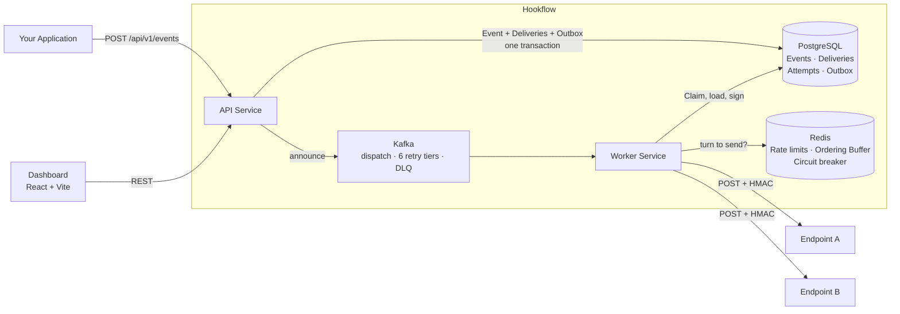

### Incoming — a provider's webhook travels in

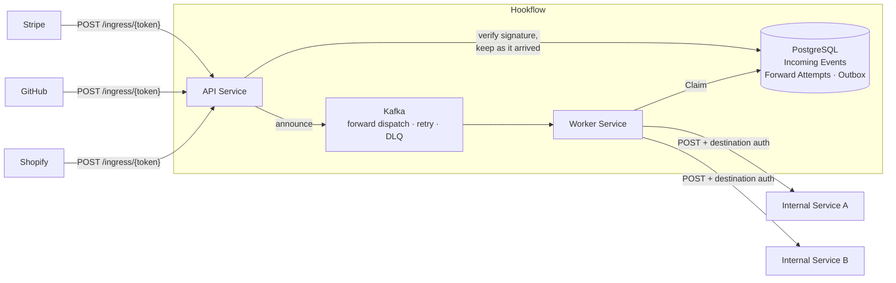

Two asymmetries are visible here and are deliberate:

- The incoming direction has **no Ordering Buffer**. Hookflow did not originate these events and
  cannot know what order the provider intended, so it does not pretend to.
- The incoming direction has a **shorter Retry Ladder**. Relaying somebody else's webhook for a
  day is not a service to anyone; the provider will usually have given up long before.

## Services

| Service | Port | Role |
|---------|------|------|
| **API** | `8080` | Event ingestion, webhook ingress, REST API, Outbox announcer |
| **Worker** | `8081` | Kafka consumer, HTTP delivery, forwarding, retry scheduling |
| **UI** | `5173` | Admin dashboard (React / Vite / shadcn/ui) |
| **PostgreSQL** | `5432` | Events, Deliveries, Incoming Events, Attempts, Outbox |
| **Kafka** | `9092` | Dispatch + 6 retry tiers + forward dispatch/retry + DLQ |
| **Redis** | `6379` | Rate limiting, FIFO ordering, circuit breaker |

## Data model

The obligations, not the whole schema — billing, workflows, alerts and the schema registry hang
off `projects` the same way and are left out so the delivery path stays readable.

Note the symmetry across the dashed line: `deliveries` is to `events` what
`incoming_forward_attempts` is to `incoming_events`. That is the Delivery/Forward pairing from
`CONTEXT.md` made concrete.

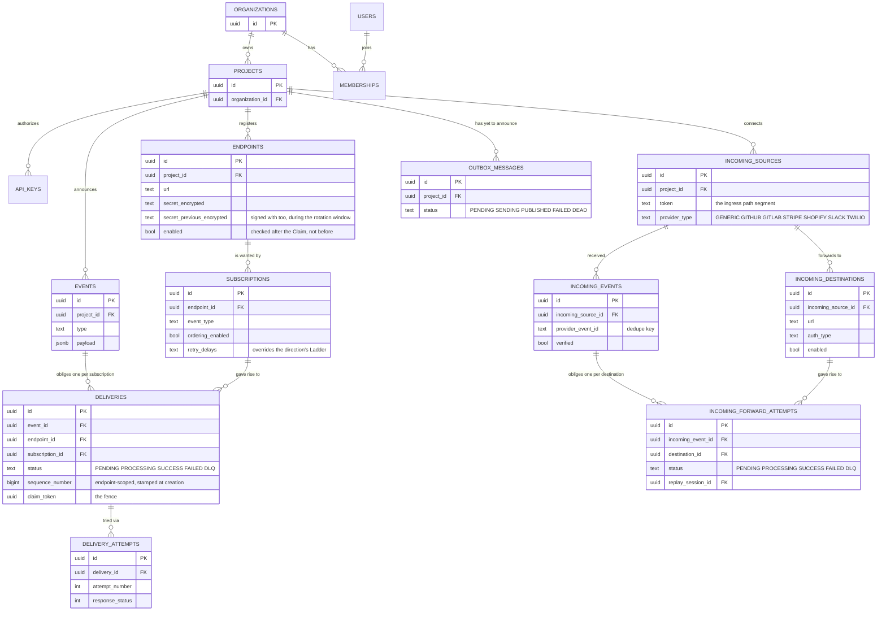

Every table above except `users` carries an `organization_id` that nothing in application code
ever writes into a `WHERE` clause — see [Tenancy](#tenancy).

## Outgoing delivery flow

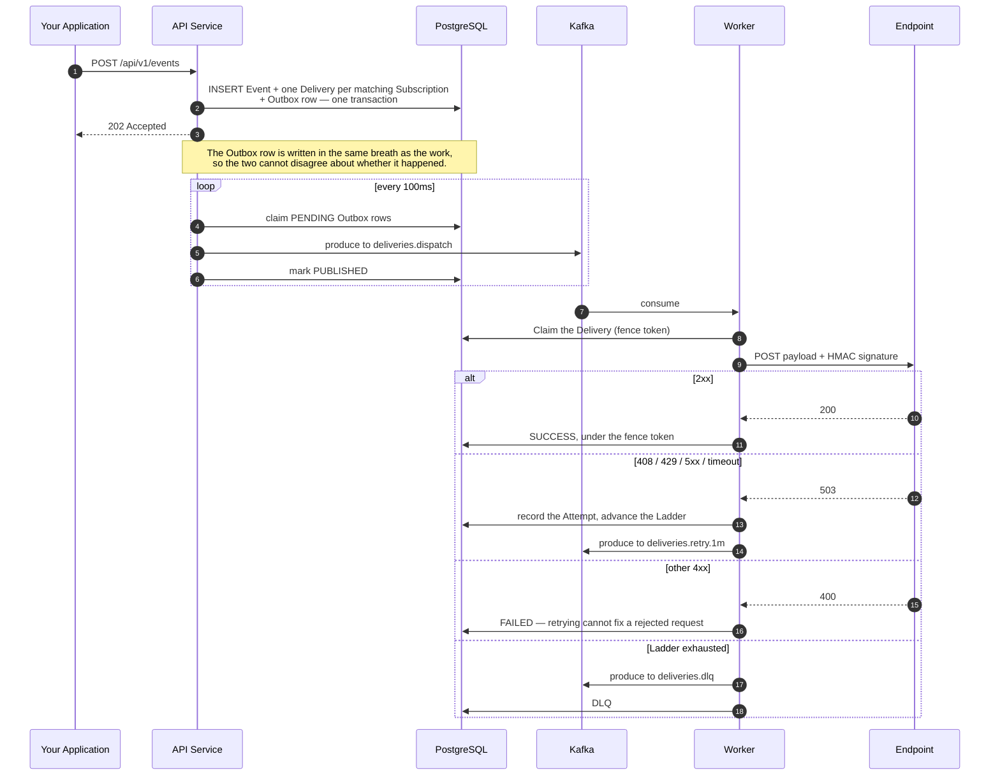

The six retry topics are real Kafka topics, one per tier —
`deliveries.retry.1m`, `.5m`, `.15m`, `.1h`, `.6h`, `.24h` — not one topic with a delay header.
A tier is a topic because a consumer that sleeps holds a partition; a topic that is polled on a
schedule does not.

## Incoming ingress flow

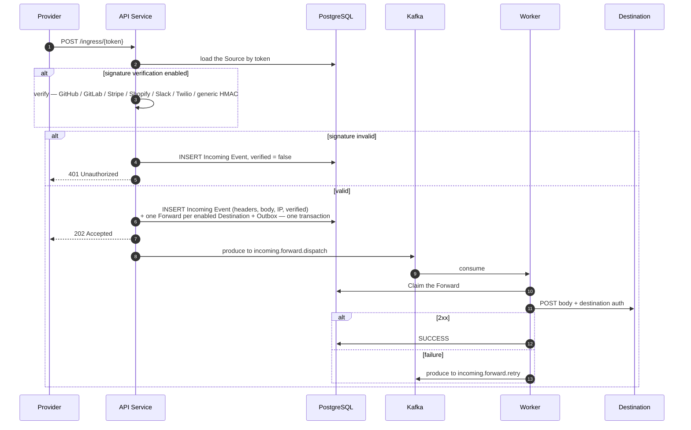

The Incoming Event is stored **before** the verdict is known, and a rejected one is stored too.
An operator debugging "the provider says it sent it" needs to see the request that failed
verification, not an absence.

## The attempt lifecycle

Both directions run the same `AttemptRunner`. Everything that differs is behind an
`AttemptStore`, of which there is one per direction. The Runner cannot read a fence token — the
Claim is a type parameter to it — which is what stops one direction's ownership rules leaking
into the other.

`AttemptRunner`'s javadoc states five invariants, each of which was once correct on one
direction and wrong on the other. Read it before changing anything here.

### Claim and fence

A Claim is exclusive ownership of one Delivery or Forward for the duration of one Attempt.
It is revocable, because the holder can die. The fence token is what makes revocation safe:
a finalisation only lands if it still matches.

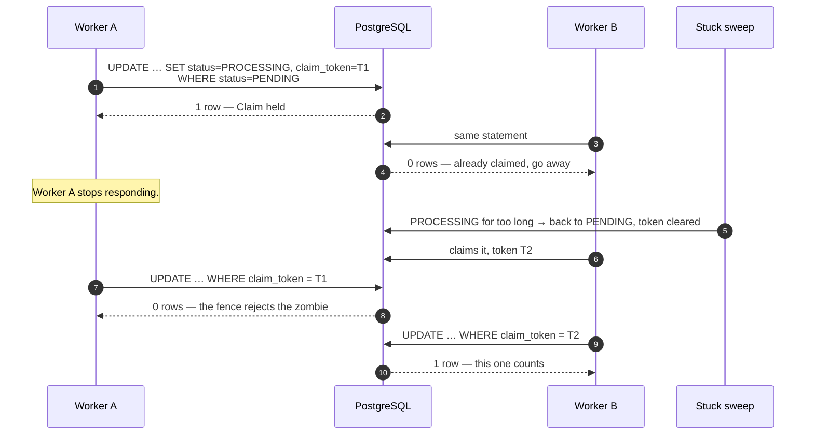

Without the fence, the recovered worker's late write would overwrite an outcome that a live
worker had already recorded — the shape of every duplicate-delivery bug this design exists to
prevent.

### Admission, and what a Deferral is

Once the Claim is held, five limits are checked in a fixed order. Any of them ends the Attempt
before a request is built — and that is a **Deferral**, not a failure: nothing was tried, so
nothing is charged against the Ladder.

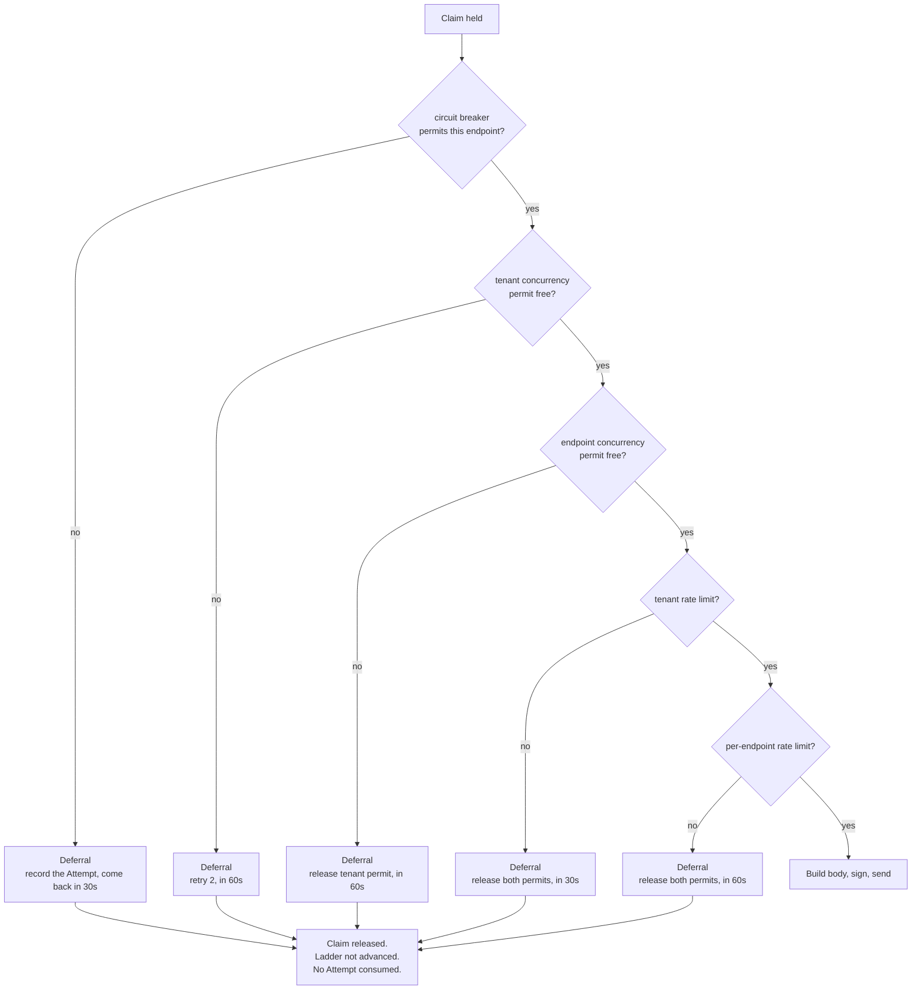

The order is not arbitrary. The breaker is first because it is the only check that costs
nothing and rejects the most. Every path that takes a permit releases it, including the ones
that throw before the request exists — invariant 3.

The circuit-breaker check is the one exception to "a Deferral records nothing": it writes an
Attempt row with `CIRCUIT_BREAKER_OPEN`, because an endpoint that has gone quiet should show an
operator *why* it went quiet rather than simply stopping.

### Delivery and Forward states

Identical state sets on both sides — `PENDING`, `PROCESSING`, `SUCCESS`, `FAILED`, `DLQ`.

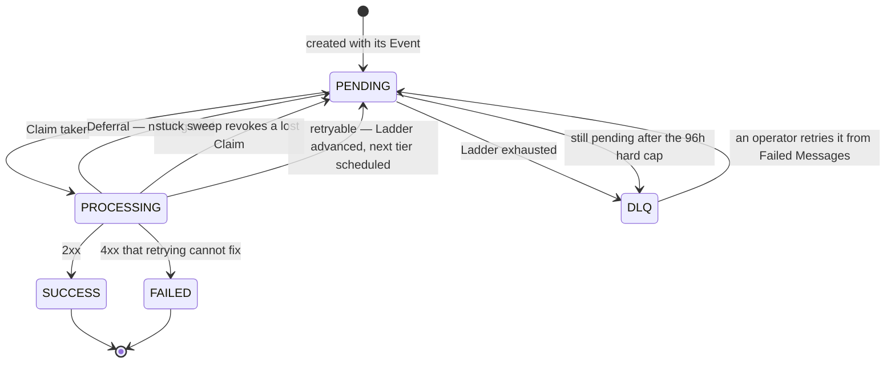

Three transitions carry the whole design:

- `PROCESSING → PENDING` happens for three unrelated reasons — a Deferral, a revoked Claim, and
  an ordinary retry. Only the third advances the Ladder.
- `PENDING → DLQ` has a second cause beyond the Ladder. `StaleDeliveryEscalationService` sweeps
  anything still `PENDING` past a hard cap (default 96h, comfortably past the default Ladder's
  ~83h worst case) so a long-degraded endpoint cannot grow the backlog without bound. It also
  exports `delivery_oldest_pending_age_seconds`, which is the gauge to alert on.
- `DLQ → PENDING` is a human decision. The DLQ is where an obligation is abandoned by Hookflow
  and kept for a person to decide about — the UI calls it **Failed Messages** on purpose,
  because "DLQ" is vocabulary you have to already know.

### The two ladders

Declared once, in `RetryLadderDefaults`. There is no fallback ladder anywhere — a Subscription
or Destination may override the delays and the attempt count, and nothing else may.

| | Outgoing | Incoming |
|---|---|---|
| Delays | 1m · 5m · 15m · 1h · 6h · 24h | 1m · 5m · 15m · 1h · 6h |
| Attempts | 7 | 6 |
| Reaches | ~24h after the last failure | ~6h after the last failure |

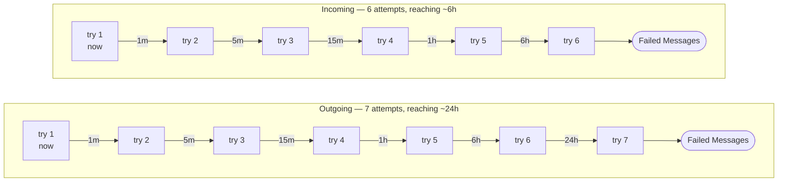

They differ on purpose. Do not "fix" that into agreement.

Separately from the Ladder, `RetryPolicy` computes an exponential backoff with 25% jitter. That
is used **only** for rescheduling a Deferral, never for a failed Attempt. Conflating the two is
how a deferred delivery ends up consuming its Ladder.

## Ordering

Outgoing only, opt-in per Subscription. Every Delivery to an endpoint is stamped with an
endpoint-scoped Sequence Number at creation; a Delivery whose predecessors have not resolved
waits in the Ordering Buffer.

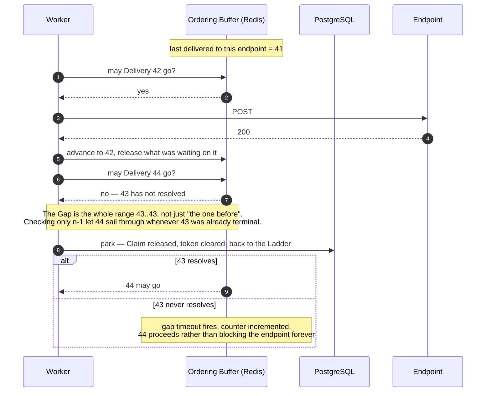

Parking hands the row back to the Ladder, so the Claim is genuinely over and the fence token is
cleared rather than left stale for a later writer to match. How fast a parked burst drains is
governed by the retry scheduler's poll cadence, not by the buffer's own delay.

## Replay is not retry

Both words describe getting an Event to an endpoint a second time, and they are different
operations with different failure modes.

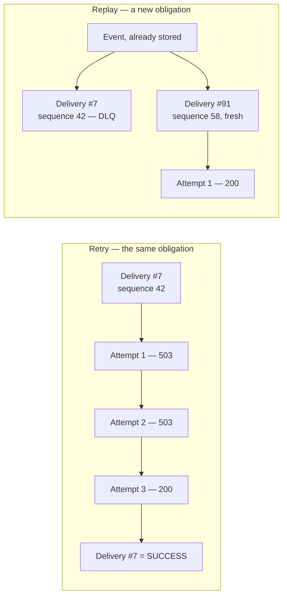

A retry is the next Attempt on the *same* Delivery, and it advances that Delivery's Ladder.
A replay builds a **fresh** Delivery from an Event already in the store, with the same content
and a new Sequence Number, and leaves the original where it is. The UI calls replay
**Time Machine**; `ReplaySession` records the batch so it can be estimated, watched and
cancelled.

The new Sequence Number is the part that matters: a replayed Delivery takes its place at the
*end* of the endpoint's order, not back at position 42 where it would block everything since.

## Tenancy

Everything a customer owns hangs off exactly one Organization. That scoping is not enforced by
application code and is not reviewable in application code — it is a Hibernate `@TenantId` on
~35 entities, resolved per request.

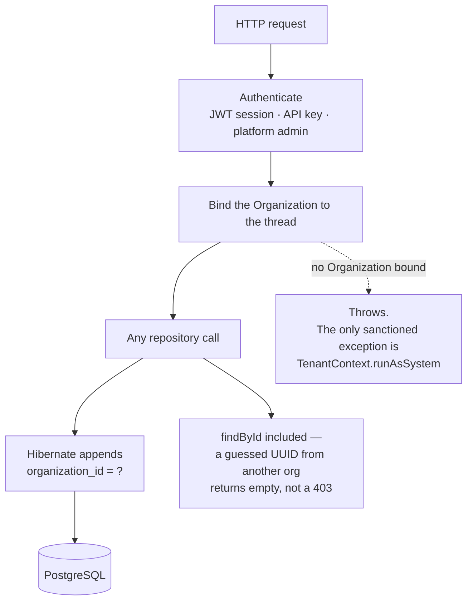

The consequence is a rule the build enforces: **never hand-roll an org check.** A service method
that takes an `organizationId` parameter fails the build, because it is either redundant with
the `@TenantId` or it is a second, weaker mechanism that will eventually disagree with it.

What `@TenantId` does *not* cover is what the ratchets exist for: work with no request behind it
needs a scope entered explicitly and outside the transaction, native queries bypass the filter,
and your own thread pool does not inherit the binding.

## Consistency, partitioning and failure modes

### What is guaranteed

**Delivery is at-least-once, never exactly-once.** An Attempt can succeed at the endpoint and
fail to record — the response arrives, the process dies before the `SUCCESS` write lands, the
stuck sweep hands the obligation to another worker, and the endpoint sees the Event twice. This
is not a defect to be engineered away; it is the honest cost of not running a transaction across
HTTP. It is why every Event carries a stable id, why the Standard Webhooks `webhook-id` header
is the Delivery id and does not change between Attempts, and why receivers are told to dedupe on
it.

**The Outbox makes acceptance and announcement agree.** The Event, its Deliveries and the Outbox
row are one transaction. Either the customer got a 202 and the work will be announced, or they
got an error and none of it exists. A separate announcer polls the Outbox — so Kafka being down
delays delivery and never loses an accepted Event.

**Ordering is per endpoint, opt-in, and outgoing only.** With `ordering_enabled` off — the
default — Deliveries to one endpoint may overtake each other freely, which is what makes the
throughput.

### Partitioning

Kafka messages are keyed so that all work for one endpoint lands on one partition, which is what
lets the Ordering Buffer be a cheap Redis check rather than a distributed sort. The cost is the
usual one: a single very busy endpoint is bounded by one partition's consumer, and adding
partitions rebalances that boundary without removing it. `delivery_attempts` and
`tunnel_request_log` are partitioned in Postgres too, by time, which is what makes retention a
detach rather than a delete.

### Failure modes worth knowing

| What breaks | What happens | Where to look |
|---|---|---|
| **Redis unreachable** | The circuit breaker **fails open** — calls are permitted rather than blocked, because refusing every delivery is worse than losing a safety net. It is counted, not silent. | `circuit_breaker_degraded_total` |
| **An endpoint is degraded for days** | The Ladder runs out, and anything still `PENDING` past the hard cap is escalated to Failed Messages. Backlog is bounded. | `delivery_oldest_pending_age_seconds` |
| **Retry storm after a mass outage** | `RetryGovernor` applies AIMD congestion control to the scheduler's batch size, plus a queue-depth admission gate and a consecutive-failure cooldown. | governor gauges |
| **A worker dies mid-Attempt** | The Claim is revoked by the stuck sweep and the fence token stops the zombie's late write. The endpoint may see a duplicate. | see at-least-once, above |
| **Kafka consumer lag** | Deliveries are late, not lost — the Outbox already recorded them. | consumer lag dashboard |
| **A transformation template breaks** | Treated as **retryable**, and the raw payload is never sent in its place. A template fixed within the Ladder still gets the Event out. | invariant 4 |
| **Postgres restored from backup** | Postgres, Kafka and Redis can disagree about what has been delivered. **There is no written reconciliation procedure for this** — see `OPERATIONS.md`. | known limitation |

### Scaling limits

API and worker are stateless and scale horizontally; both have an HPA in the chart. The binding
constraints, in the order they are usually hit: Postgres write throughput on
`delivery_attempts`, partition count for a single hot endpoint, and Redis round-trips per Attempt
on the ordering path.

## Production topology

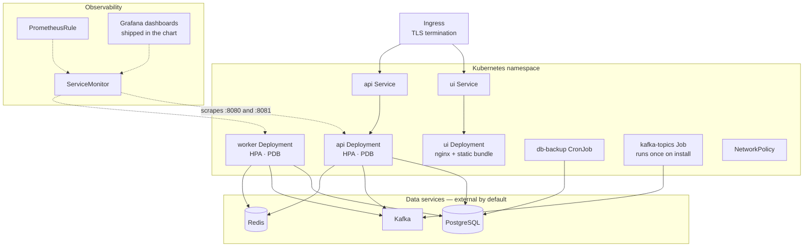

The chart ships no database. Postgres, Kafka and Redis are configured as external services
because an operator who is going to run this in production already has opinions about all three,
and a bundled subchart mostly serves to make the first `helm install` look easy and the first
upgrade look impossible.

## CLI tunnel flow

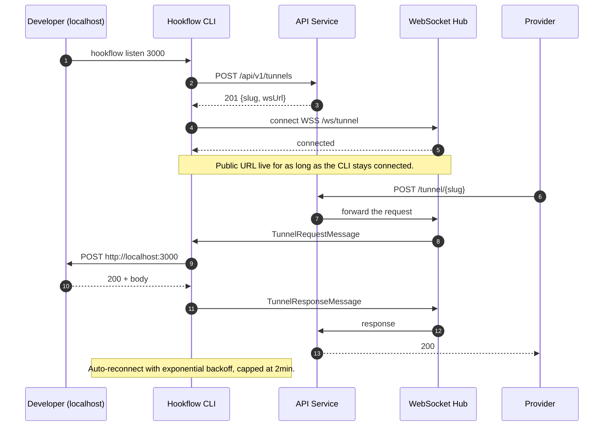
