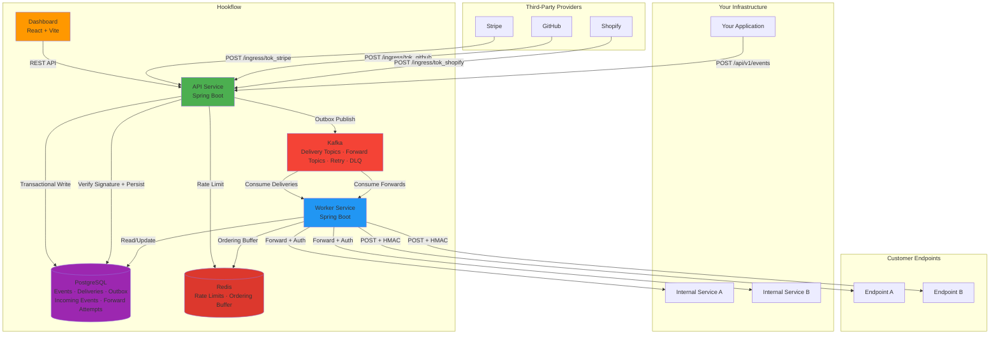
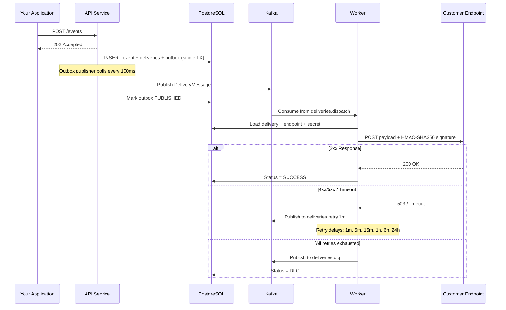
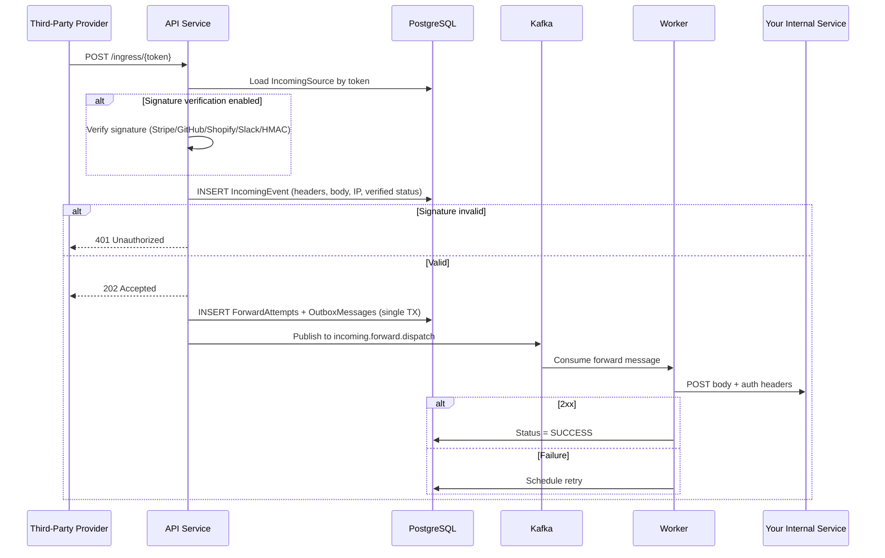
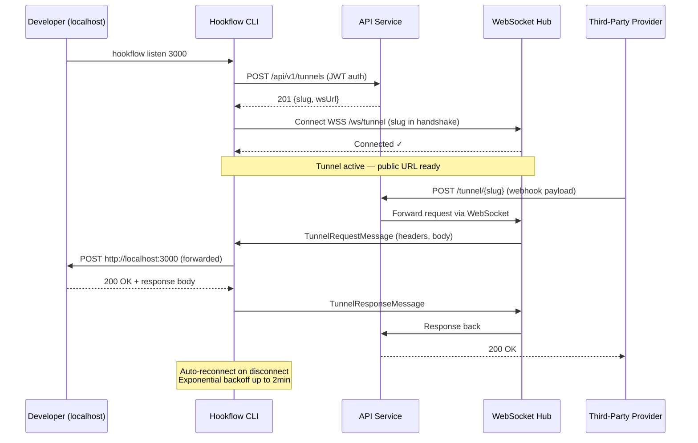

# Architecture

How Hookflow is put together, and why. For the vocabulary these diagrams use —
Event, Delivery, Forward, Claim, Attempt, Deferral — read [`CONTEXT.md`](../CONTEXT.md)
first; each term there carries a list of near-synonyms deliberately not used.

| Service | Port | Role |
|---------|------|------|
| **API** | `8080` | Event ingestion, webhook ingress, REST API, outbox publisher |
| **Worker** | `8081` | Kafka consumer, HTTP delivery, forwarding, retry scheduling |
| **UI** | `5173` | Admin dashboard (React / Vite / shadcn/ui) |
| **PostgreSQL** | `5432` | Events, deliveries, incoming events, outbox |
| **Kafka** | `9092` | Dispatch + 6 retry tiers + forward dispatch/retry + DLQ |
| **Redis** | `6379` | Rate limiting, FIFO ordering, circuit breaker |

## Outgoing Delivery Flow

## Incoming Ingress Flow

## CLI Tunnel Flow

---
